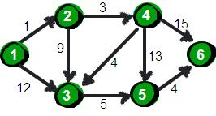
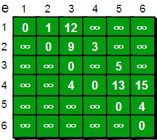
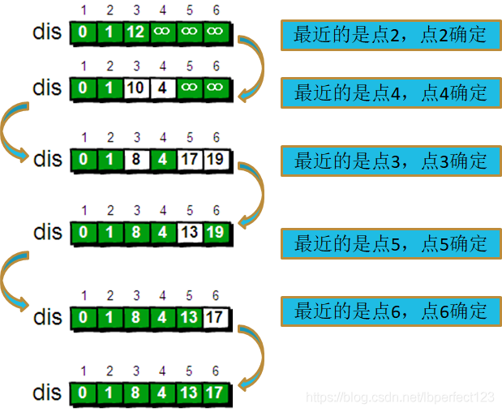

# Dijkstra算法图文详解


置顶 [lbperfect123](https://me.csdn.net/lbperfect123) 2018-11-20 09:19:59  106392  收藏  321 

分类专栏： [最短路](https://blog.csdn.net/lbperfect123/category_8378788.html)

版权

**Dijkstra算法**

Dijkstra算法算是**贪心思想**实现的，首先把起点到所有点的距离存下来找个最短的，然后松弛一次再找出最短的，所谓的松弛操作就是，遍历一遍看通过刚刚找到的距离最短的点作为中转站会不会更近，如果更近了就更新距离，这样把所有的点找遍之后就存下了起点到其他所有点的最短距离。

问题引入：

指定一个点（源点）到其余各个顶点的最短路径，也叫做“单源最短路径”。例如求下图中的1号顶点到2、3、4、5、6号顶点的最短路径。


 

 


 

 

 下面我们来模拟一下：





 这就是Dijkstra算法的基本思路：

接下来是代码：

已经把几个过程都封装成了基本模块：

```cpp
#include<cstdio>
#include<cstring>
#include<algorithm>
#include<iostream>
#define Inf 0x3f3f3f3f
 
using namespace std;
 
int map[1005][1005];
 
int vis[1005],dis[1005];
int n,m;//n个点，m条边
 
void Init ()
{
	memset(map,Inf,sizeof(map));
	for(int i=1;i<=n;i++)
	{
		map[i][i]=0;
	}
}
 
void Getmap()
{
	int u,v,w;
    for(int t=1;t<=m;t++)
	{
	  	scanf("%d%d%d",&u,&v,&w);
	  	if(map[u][v]>w)
		  {
		  map[u][v]=w;
		  map[v][u]=w;
	      }
	}	
	
}
 
void Dijkstra(int u)
{
	memset(vis,0,sizeof(vis));
	for(int t=1;t<=n;t++)
	{
		dis[t]=map[u][t];
	}
	vis[u]=1;
	for(int t=1;t<n;t++)
	{
		int minn=Inf,temp;
		for(int i=1;i<=n;i++)
		{
			if(!vis[i]&&dis[i]<minn)
			{
				minn=dis[i];
				temp=i;
			}
		}
		vis[temp]=1;
		for(int i=1;i<=n;i++)
		{
			if(map[temp][i]+dis[temp]<dis[i])
			{
				dis[i]=map[temp][i]+dis[temp];
			}
		}
	}
	
}
 
int main()
{
	
	scanf("%d%d",&m,&n);
	Init();
	Getmap();
	Dijkstra(n);
	printf("%d\n",dis[1]);
	
	
	return 0;
}
```

---------------------------------------------------


原网址: [访问](https://blog.csdn.net/lbperfect123/article/details/84281300)

创建于: 2020-09-29 17:04:39

目录: default

标签: `blog.csdn.net`

