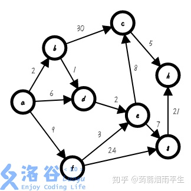
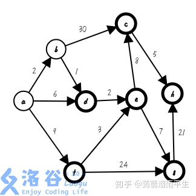
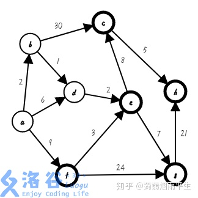
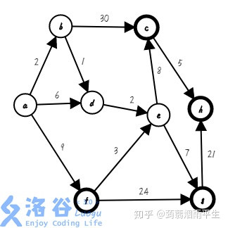
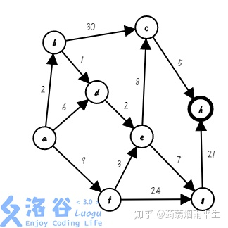
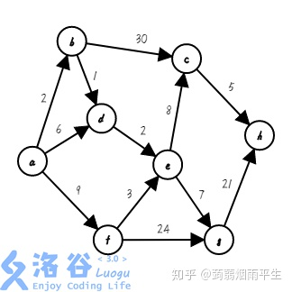

# (7 封私信 / 87 条消息) 帮忙通俗解释一下Dijkstra算法 ？ - 知乎

这个是从我的[这一篇博客](https://link.zhihu.com/?target=https%3A//www.luogu.org/blog/85682/xue-tu-lun-ni-zhen-di-liao-xie-zui-duan-lu-ma-post)摘过来的，有兴趣可以看一看

  

开始把距离起点最近的点写成了距离集合最近的点了，我谢罪（哭）

  

Dijkstra是目前各大 OIER 们最爱用的最短路算法了， Dijkstra 是单源最短路算法，不能处理带负边权的情况，用邻接矩阵或邻接表存图

下面我们来讲解一下它的思路：

我们找来一个图：

  



  

假设它的起点是 a ，要求它到各点的最短距离

Dijkstra 思路是维护一个集合 s ，集合内的点是已经确定最短路的点，可以视为一个大整体，每次操作找出与集合相邻的点中距离起点最近的点加入集合中，并确定它的最短路为它的上家的最短路+该边权值，存在 dis 中

接下来图就要变丑了，请注意

第一步，我们先把 a 加入集合，不加粗的点为集合中的点，下同（ s={a} ; dis\[\]={0,∞,∞,∞,∞,∞,∞,∞}）：

  


  

第二步，我们找出与集合相邻且距离起点最近的点 b ，把它加入集合，并确定它的最短路 0+2=2，存入数组（ s={a,b} ; dis\[\]={0,2,∞,∞,∞,∞,∞,∞}）：

  



  

第三步，我们找出与集合相邻且距离起点最近的点 d，把它加入集合，并确定它的最短路 2+1=3，存入数组（ s={a,b,d}; dis\[\]={0,2,∞,3,∞,∞,∞,∞} ）：

  



  

第四步，我们找出与集合相邻且距离起点最近的点 e，把它加入集合，并确定它的最短路 3+2=5（ s={a,b,d,e}; dis\[\]={0,2,∞,3,5,∞,∞,∞}）:

  



  

第五步，我们找出与集合相邻且距离起点最近的点 f，把它加入集合，并确定它的最短路 0+9=9 （ s={a,b,d,e,f} ; dis\[\]={0,2,∞,3,5,9,∞,∞} ）:

  


  

第六步，我们找出与集合相邻且距离起点最近的点 g ，把它加入集合，并确定它的最短路 5+7=12（ s={a,b,d,e,f,g}; dis\[\]={0,2,∞,3,5,9,12,∞} ）:

  


  

第七步，我们找出与集合相邻且距离起点最近的点 c ，把它加入集合，并确定它的最短路 5+8=13（ s={a,b,c,d,e,f,g} ; dis\[\]={0,2,13,3,5,9,12,∞} ）:

  



  

第八步，也是最后一步，我们找出与集合相邻且距离起点最近的点 h ，把它加入集合，并确定它的最短路 13+5=18 （ s={a,b,c,d,e,f,g,h} ; dis\[\]={0,2,13,3,5,9,12,18} ）:

  



  

至此，整个图的最短路被我们求了出来， Dijkstra顺利完成！

理解了它的思路，那么怎么用代码实现呢？

先用邻接矩阵存储数据，考虑采用一个二重循环，每次寻找出距离集合最近的一个点，然后数组标记它已经加入集合，然后在用当前点对不在集合中的点进行松弛，进行 n_n_ 次，整个操作就完成了（此处代码中默认起点是1）

```cpp
void dijkstra()
{
    memset(dis,127/3,sizeof(dis));//初始化
    v[1]=1;
    dis[1]=0;
    for(int i=1;i<=n;++i)
    {
        int k=0;
        for(int j=1;j<=n;++j)//找出距离最近的点
            if(!v[j]&&(k==0||dis[j]<dis[k]))
                k=j;
        v[k]=1;//加入集合
        for(int j=1;j<=n;++j)//松弛
            if(!v[j]&&dis[k]+a[k][j]<dis[j])
                dis[j]=dis[k]+a[k][j];
    }
}
```

通过上述代码不难发现 Dijkstra 的时间复杂度是 O(n^2)

个人认为 Dijkstra是最重要的算法之一，这里推荐几道练手题，可以去做

[P1359 租用游艇](https://link.zhihu.com/?target=https%3A//www.luogu.org/problemnew/show/P1359)

[P3371 【模板】单源最短路径（弱化版）](https://link.zhihu.com/?target=https%3A//www.luogu.org/problemnew/show/P3371)

[P1938 \[USACO09NOV\]找工就业Job Hunt](https://link.zhihu.com/?target=https%3A//www.luogu.org/problemnew/show/P1938)

[P1457 城堡 The Castle](https://link.zhihu.com/?target=https%3A//www.luogu.org/problemnew/show/P1457)（这是一道 BFS。但是 Dijkstra 可做，且有一定思维难度，也有一些坑，比如如何取出每一面墙和优先顺序之类的细节也很有趣，在这里特别推荐大家做此题）

* * *

### 拓展 ：优化 Dijkstra

以下内容摘自我的[另一篇博客](https://link.zhihu.com/?target=https%3A//www.luogu.org/blog/85682/solution-p3956)

众所周知

Dijkstra 复杂度为 O(n^2)

而且是实打实的 O(n^2) ，不会提前结束循环

那么 n 巨大无比怎么办？

  


  

C++ 大手一挥：

  


  

相信大家都知道 STL 里有个东西叫做 queue

虽然queue也可以用vector代替

但是这里面有一个逆天的东西叫做 priority\_queue （优先队列）

这个东西是真的好用，自动排序

我们就可以省去松弛和查找操作，直接把节点和数据丢进优先队列，然后最小的就会浮出水面\\(^o^)/~并且改用邻接表存储，省去一大些时间和空间

用它来优化 Dijkstra再合适不过啦

但是这个玩意也有他不友善的一面，不支持在线修改

使用 dis数组维护集合，更新最小值，可以找到元素直接修改

但是你把它扔进 priority\_queue ，当场歇菜

你都找不到这个元素

那怎么办呢？

C++真是一门难学的语言


  

我们不管他，照旧扔新元素进去，但是要用一个数组标记这个东西吐没吐出来，如果下一回吐出来了已经吐过的点直接扔掉就行了

说到这里，我们发现知道距离的同时，还要知道节点编号，这意味着我们扔给 priority\_queue 的应该是一组数据

有的大佬说：用 pair

但是打完程序大概是这个样：

```cpp
xxx.first...xxx.second
xxx.first
xxx.second
xxx.first
xxx.first
xxx.second
xxx.first...xxx.second
```

我￥#@……（）&##\*“~·\*\*\*￥$^！？！>}】【数据删除，省略某些内容】

鬼知道 first和 second是什么东西呀

所以我们不用 pair

自己写结构体

```cpp
struct queue_element
{
    int x,y,value;
    queue_element(int x_,int y_,int value_):
        x(x_),y(y_),value(value_){}//赋值，没有为什么，背过
};
```

C++真是一门难学的语言


  

你以为就这样结束了？

恭喜你，CE快乐

然后我们发现 priority\_queue 不认这玩意

因为有两个数据，优先队列不知道应该用哪个数据，什么方法判断大小，所以它不会比较

于是，我们要重载 < ，让优先队列明白怎么比较大小

```cpp
bool operator < (const queue_element &other) const
    {
        return value>other.value;//这样重载是小根堆，因为堆的比较是反过来的-_-||
    }
```

然后就没问题了

C++真是一门难学的语言


  

```cpp
inline void dijkstra()//可以不带参数，也可以把起点带进来
{
    priority_queue<element> q;//优先队列大法吼
    q.push(element(1,0));//把起点压进去
    while(!q.empty())//不空就说明还有点没搜完
    {
        element k=q.top();//取出队首
        q.pop();
        if(vis[k.node])//如果已经在集合中（被搜到过）
            continue;//扔掉
        vis[k.node]=1;//标记
        dis[k.node]=k.value;//存下最短路（由于优先队列的排序已经相当于完成了松弛，所以这就是答案）
        for(vector<edge>::iterator it=v[k.node].begin();it!=v[k.node].end();++it)//用指针遍历邻接表
            q.push(element(it->node,it->weight+k.value));//松弛
    }
}
```

这样一来，均摊时间复杂度降为 O((e+n)log n) ，效率大大提升，处理稀疏图所向披靡^\_^

---------------------------------------------------


原网址: [访问](https://www.zhihu.com/question/20630094/answer/758191548)

创建于: 2020-09-29 17:04:03

目录: default

标签: `www.zhihu.com`

