# 漫画：深度优先遍历 和 广度优先遍历

[前端小苑-FE GDN](https://me.csdn.net/yuqing1008) 2019-03-28 10:38:53  14  收藏 

**—————  第二天  —————**

————————————

**什么是 深度/广度 优先遍历？**

深度优先遍历简称**DFS**（Depth First Search），广度优先遍历简称**BFS**（Breadth First Search），它们是遍历图当中所有顶点的两种方式。

这两种遍历方式有什么不同呢？我们来举个栗子：

我们来到一个游乐场，游乐场里有11个景点。我们从景点0开始，要玩遍游乐场的所有景点，可以有什么样的游玩次序呢？

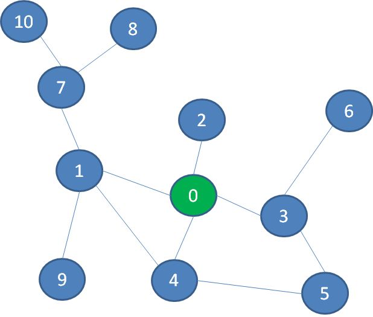

第一种是一头扎到底的玩法。我们选择一条支路，尽可能不断地深入，如果遇到死路就往回退，回退过程中如果遇到没探索过的支路，就进入该支路继续深入。

在图中，我们首先选择景点1的这条路，继续深入到景点7、景点8，终于发现走不动了（景点旁边的数字代表探索次序）：

于是，我们退回到景点7，然后探索景点10，又走到了死胡同。于是，退回到景点1，探索景点9：

按照这个思路，我们再退回到景点0，后续依次探索景点2、3、5、4、6，终于玩遍了整个游乐场：

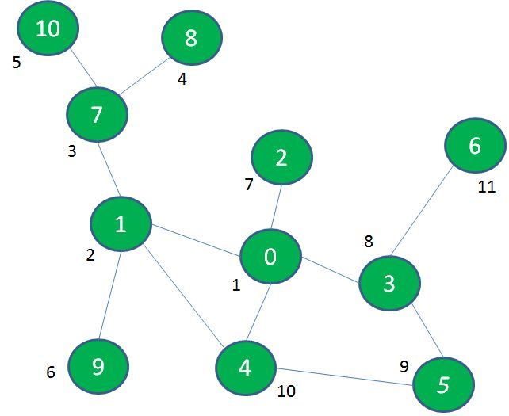

像这样先深入探索，走到头再回退寻找其他出路的遍历方式，就叫做**深度优先遍历（DFS）**。

除了像深度优先遍历这样一头扎到底的玩法以外，我们还有另一种玩法：首先把起点相邻的几个景点玩遍，然后去玩距离起点稍远一些（隔一层）的景点，然后再去玩距离起点更远一些（隔两层）的景点......

在图中，我们首先探索景点0的相邻景点1、2、3、4：

接着，我们探索与景点0相隔一层的景点7、9、5、6：

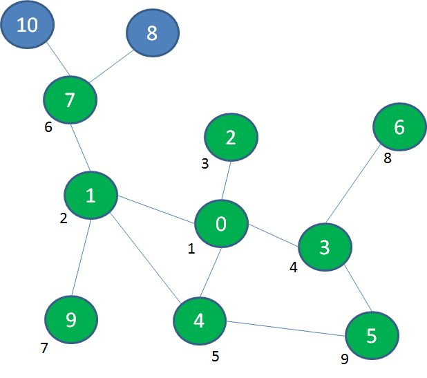

最后，我们探索与景点0相隔两层的景点8、10：

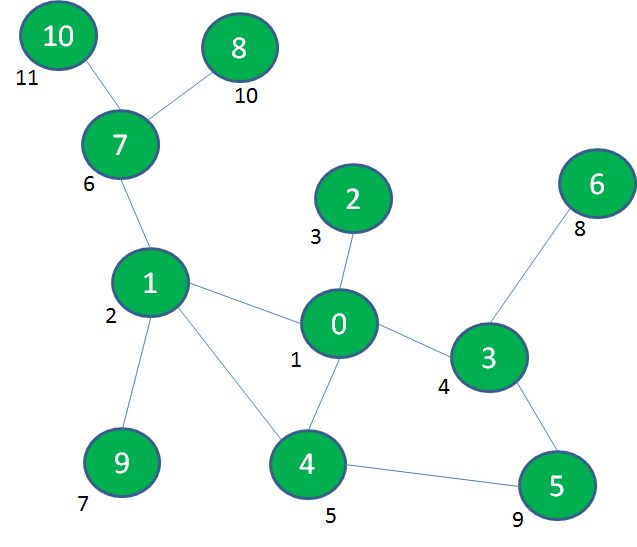

像这样一层一层由内而外的遍历方式，就叫做**广度优先遍历（BFS）**。

**深度/广度优先遍历 的实现**

**深度优先遍历**

首先说说深度优先遍历的实现过程。这里所说的回溯是什么意思呢？回溯顾名思义，就是自后向前，追溯曾经走过的路径。

我们把刚才游乐场的例子抽象成数据结构的图，假如我们依次访问了顶点0、1、7、8，发现无路可走了，这时候我们要从顶点8退回到顶点7。

而后我们探索了顶点10，又无路可走了，这时候我们要从顶点10退回到顶点7，再退回到顶点1。

像这样的自后向前追溯曾经访问过的路径，就叫做回溯。

要想实现回溯，可以利用**栈**的先入后出特性，也可以采用**递归**的方式（因为递归本身就是基于方法调用栈来实现）。

下面我们来演示一下具体实现过程。

首先访问顶点0、1、7、8，这四个顶点依次入栈，此时顶点8是栈顶：

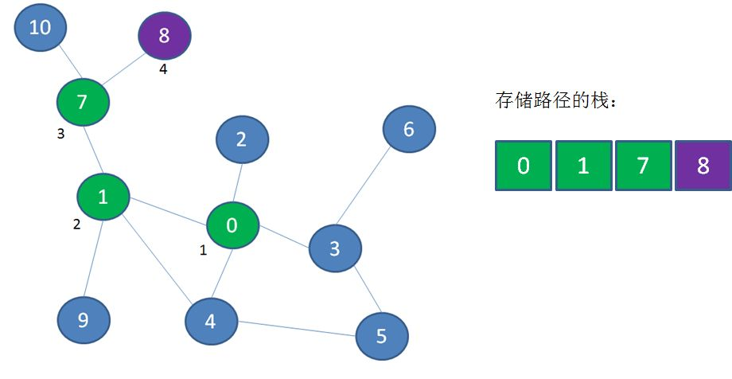

从顶点8退回到顶点7，顶点8出栈：

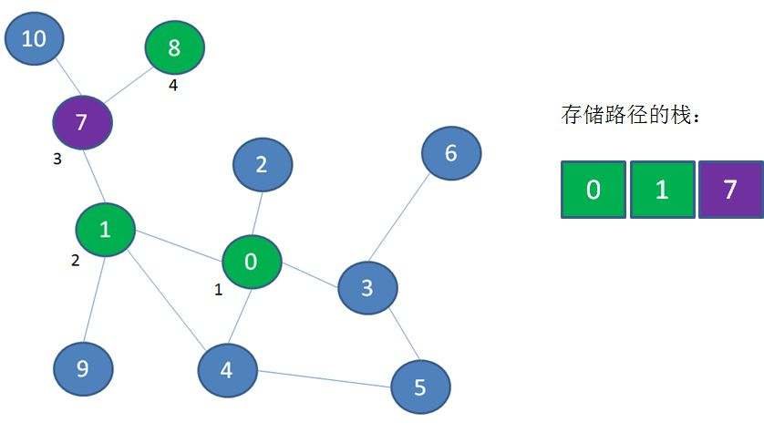

接下来访问顶点10，顶点10入栈：

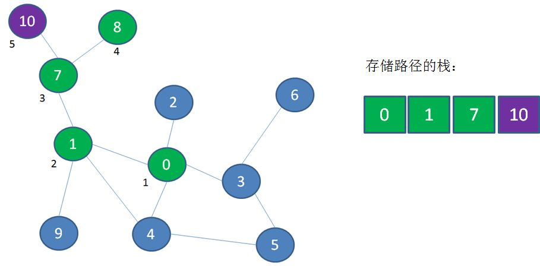

从顶点10退到顶点7，从顶点7退到顶点1，顶点10和顶点7出栈：

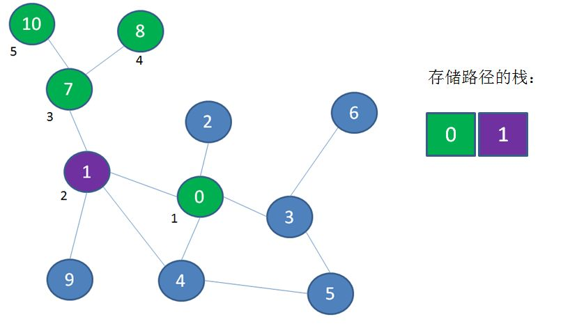

探索顶点9，顶点9入栈：

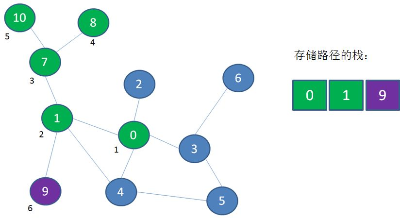

以此类推，利用这样一个临时栈来实现回溯，最终遍历完所有顶点。

**广度优先遍历**

接下来该说说广度优先遍历的实现过程了。刚才所说的重放是什么意思呢？似乎听起来和回溯差不多？其实，回溯与重放是完全相反的过程。

仍然以刚才的图为例，按照广度优先遍历的思想，我们首先遍历顶点0，然后遍历了邻近顶点1、2、3、4：

接下来我们要遍历更外围的顶点，可是如何找到这些更外围的顶点呢？我们需要把刚才遍历过的顶点1、2、3、4按顺序重新回顾一遍，从顶点1发现邻近的顶点7、9；从顶点3发现邻近的顶点5、6。

像这样把遍历过的顶点按照之前的遍历顺序重新回顾，就叫做重放。同样的，要实现重放也需要额外的存储空间，可以利用**队列**的先入先出特性来实现。

下面我们来演示一下具体实现过程。

首先遍历起点顶点0，顶点0入队：

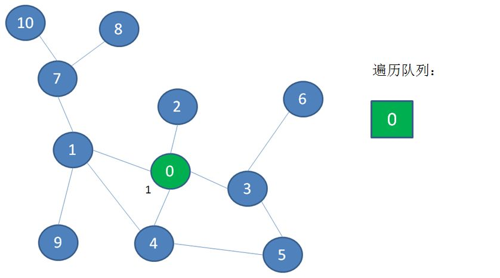

接下来顶点0出队，遍历顶点0的邻近顶点1、2、3、4，并且把它们入队：

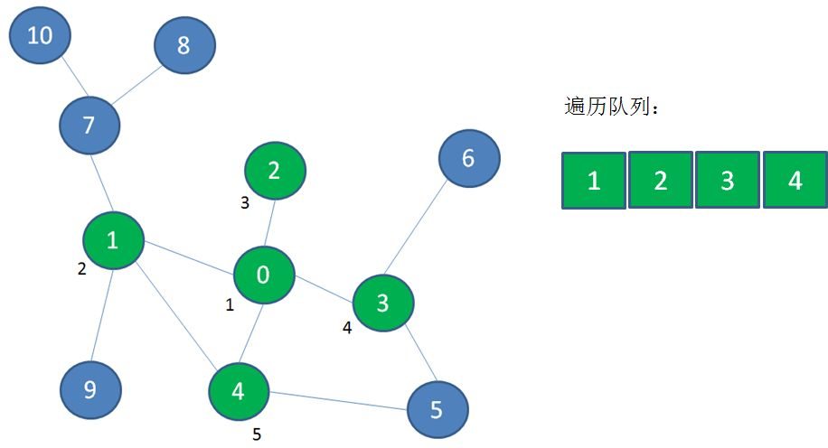

然后顶点1出队，遍历顶点1的邻近顶点7、9，并且把它们入队：

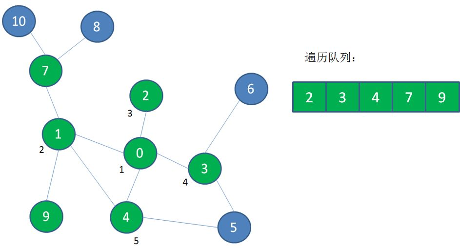

然后顶点2出队，没有新的顶点可入队：

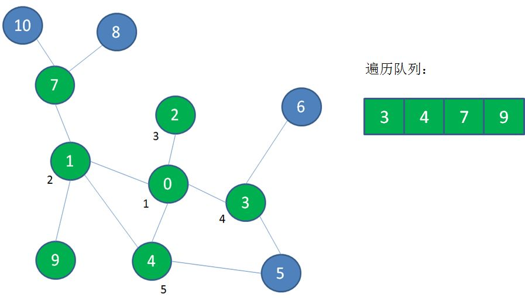

以此类推，利用这样一个队列来实现重放，最终遍历完所有顶点。

1.  `/**`
    
2.  `* 图的顶点`
    
3.  `*/`
    
4.  `private static class Vertex {`
    
5.  `int data;`
    
6.  `Vertex(int data) {`
    
7.  `this.data = data;`
    
8.  `}`
    
9.  `}`
    

11.  `/**`
    
12.  `* 图（邻接表形式）`
    
13.  `*/`
    
14.  `private static class Graph {`
    
15.  `private int size;`
    
16.  `private Vertex[] vertexes;`
    
17.  `private LinkedList<Integer> adj[];`
    

19.  `Graph(int size){`
    
20.  `this.size = size;`
    
21.  `//初始化顶点和邻接矩阵`
    
22.  `vertexes = new Vertex[size];`
    
23.  `adj = new LinkedList[size];`
    
24.  `for(int i=0; i<size; i++){`
    
25.  `vertexes[i] = new Vertex(i);`
    
26.  `adj[i] = new LinkedList();`
    
27.  `}`
    
28.  `}`
    
29.  `}`
    

1.  `/**`
    
2.  `* 深度优先遍历`
    
3.  `*/`
    
4.  `public static void dfs(Graph graph, int start, boolean[] visited) {`
    
5.  `System.out.println(graph.vertexes[start].data);`
    
6.  `visited[start] = true;`
    
7.  `for(int index : graph.adj[start]){`
    
8.  `if(!visited[index]){`
    
9.  `dfs(graph, index, visited);`
    
10.  `}`
    
11.  `}`
    
12.  `}`
    

1.  `/**`
    
2.  `* 广度优先遍历`
    
3.  `*/`
    
4.  `public static void bfs(Graph graph, int start, boolean[] visited, LinkedList<Integer> queue) {`
    
5.  `queue.offer(start);`
    
6.  `while (!queue.isEmpty()){`
    
7.  `int front = queue.poll();`
    
8.  `if(visited[front]){`
    
9.  `continue;`
    
10.  `}`
    
11.  `System.out.println(graph.vertexes[front].data);`
    
12.  `visited[front] = true;`
    
13.  `for(int index : graph.adj[front]){`
    
14.  `queue.offer(index);;`
    
15.  `}`
    
16.  `}`
    
17.  `}`
    

20.  `public static void main(String[] args) {`
    
21.  `Graph graph = new Graph(6);`
    

23.  `graph.adj[0].add(1);`
    
24.  `graph.adj[0].add(2);`
    
25.  `graph.adj[0].add(3);`
    

27.  `graph.adj[1].add(0);`
    
28.  `graph.adj[1].add(3);`
    
29.  `graph.adj[1].add(4);`
    

31.  `graph.adj[2].add(0);`
    

33.  `graph.adj[3].add(0);`
    
34.  `graph.adj[3].add(1);`
    
35.  `graph.adj[3].add(4);`
    
36.  `graph.adj[3].add(5);`
    

38.  `graph.adj[4].add(1);`
    
39.  `graph.adj[4].add(3);`
    
40.  `graph.adj[4].add(5);`
    

42.  `graph.adj[5].add(3);`
    
43.  `graph.adj[5].add(4);`
    

45.  `System.out.println("图的深度优先遍历：");`
    
46.  `dfs(graph, 0, new boolean[graph.size]);`
    
47.  `System.out.println("图的广度优先遍历：");`
    
48.  `bfs(graph, 0, new boolean[graph.size], new LinkedList<Integer>());`
    
49.  `}`
    

—————END—————

**文章转载自公众号 程序员小灰（chengxuyuanxiaohui）**

---------------------------------------------------

原网址: [访问](https://blog.csdn.net/yuqing1008/article/details/103523373)

创建于: 2020-09-27 09:23:51

目录: default

标签: `blog.csdn.net`

