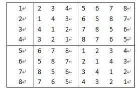
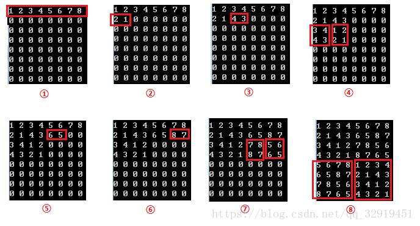
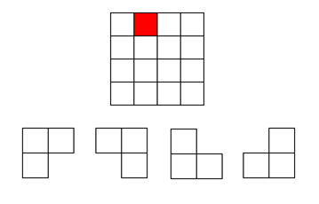
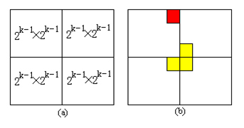
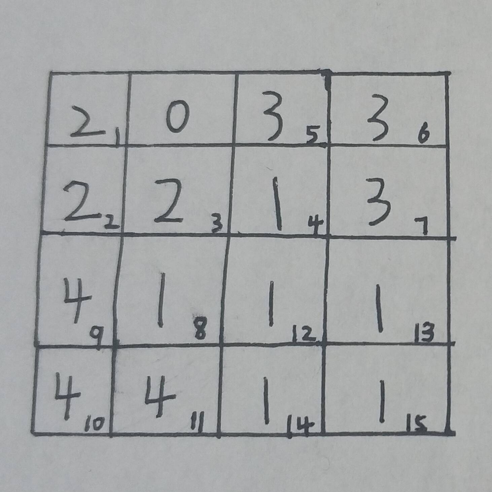

# **_1_**|**_0_****贪心算法**

  

## **_1_**|**_1_****基本概念**

  

所谓贪心算法是指，在对问题求解时，总是做出**在当前看来是最好的选择**。也就是说，不从整体最优上加以考虑，他所做出的仅是在某种意义上的**局部最优解。**

贪心算法没有固定的算法框架，算法设计的关键是贪心策略的选择。必须注意的是，贪心算法不是对所有问题都能得到整体最优解，选择的贪心策略必须具备无后效性，即某个状态以后的过程不会影响以前的状态，只与当前状态有关。

 **所以对所采用的贪心策略一定要仔细分析其是否满足无后效性。**

## **_1_**|**_2_****贪心算法的基本思路**

  

1.  建立数学模型来描述问题。

　　  2. 把求解的问题分成若干个子问题。

　　  3. 对每一子问题求解，得到子问题的局部最优解。

　　  4. 把子问题的解局部最优解合成原来解问题的一个解。

## **_1_**|**_3_****贪心算法的 实现框架**

  

贪心算法适用的前提是：局部最优策略能导致产生全局最优解

实际上，**贪心算法适用的情况很少。**一般，对一个问题分析是否适用于贪心算法，可以先选择该问题下的几个实际数据进行分析，就可做出判断。  

## **_1_**|**_4_****贪心算法的实现框架**

  

    从问题的某一初始解出发；

    while （能朝给定总目标前进一步）

    { 

          利用可行的决策，求出可行解的一个解元素；

    }

    由所有解元素组合成问题的一个可行解；

## **_1_**|**_5_****贪心策略的选择**

  

     因为用贪心算法只能通过解局部最优解的策略来达到全局最优解，因此，一定要注意判断问题是否适合采用贪心算法策略，找到的解是否一定是问题的最优解。

## **_1_**|**_6_****例题分析**

  

    下面是一个可以试用贪心算法解的题目，贪心解的确不错，可惜不是最优解。

    \[背包问题\]有一个背包，背包容量是M=150。有7个物品，物品可以分割成任意大小。

    要求尽可能让装入背包中的物品总价值最大，但不能超过总容量。

    物品  A     B    C    D     E     F    G

    重量 35   30   60   50   40   10   25

    价值 10   40   30   50   35   40   30

    分析：

    目标函数： ∑pi最大（价值总和最大）

    约束条件是装入的物品总重量不超过背包容量：∑wi<=M( M=150)

    **（1）**根据贪心的策略，每次挑选价值最大的物品装入背包，得到的结果是否最优？

    **（2）**每次挑选所占重量最小的物品装入是否能得到最优解？

    **（3）**每次选取单位重量价值最大的物品，成为解本题的策略。

    值得注意的是，贪心算法并不是完全不可以使用，贪心策略一旦经过证明成立后，它就是一种高效的算法。

　比如，求最小生成树的Prim算法和Kruskal算法都是漂亮的贪心算法。

    贪心算法还是很常见的算法之一，这是由于它简单易行，构造贪心策略不是很困难。

    可惜的是，它需要证明后才能真正运用到题目的算法中。

    一般来说，**贪心算法的证明围绕着：整个问题的最优解一定由在贪心策略中存在的子问题的最优解得来的。**

    对于例题中的3种贪心策略，都是无法成立（无法被证明）的，解释如下：

    （1）贪心策略：选取价值最大者。反例：

    W=30

    物品：A     B   C

    重量：28  12  12

    价值：30  20  20

    根据策略，首先选取物品A，接下来就无法再选取了，可是，选取B、C则更好。

    （2）贪心策略：选取重量最小。它的反例与第一种策略的反例差不多。

    （3）贪心策略：选取单位重量价值最大的物品。反例：

    W=30

    物品： A   B    C

    重量：28  20  10

    价值：28  20  10

    根据策略，三种物品单位重量价值一样，程序无法依据现有策略作出判断，如果选择A，则答案错误。

 

**其实该情况是符合贪心策略的**，因为该总情况不管先选哪两个都会把背包塞满，因为该题物品可以分割成任意大小，所以，就算空下一下，也可以将最后一个物品分割，放进去，它们的单位重量的价值是一样的，所以，最后背包最后重量相同，重量相同那么价值也相同。）

**所以采用第三种策略，代码如下：**

package cn.itcast.recursion; import java.util.Arrays; public class GreedyPackage { private int MAX\_WEIGHT = 150; private int\[\] weights = new int\[\]{35, 30, 60, 50, 40, 10, 25}; private int\[\] values = new int\[\]{10, 40, 30, 50, 35, 40, 30}; private void packageGreedy(int capacity, int weights\[\], int\[\] values) { int n = weights.length;//物品的数量
        double\[\] r = new double\[n\];//性价比数组
        int\[\] index = new int\[n\];//性价比排序物品的下标
        for (int i = 0; i < n; i++) {
            r\[i\] \= (double) values\[i\] / weights\[i\];
            index\[i\] \= i;//默认排序
 } double temp = 0;//对性价比进行排序
        for (int i = 0; i < n - 1; i++) { for (int j = i + 1; j < n; j++) { //降序，对性价比和对应下标进行排序
                if (r\[i\] < r\[j\]) {
                    temp \= r\[i\];
                    r\[i\] \= r\[j\];
                    r\[j\] \= temp; int x = index\[i\];
                    index\[i\] \= index\[j\];
                    index\[j\] \= x;
                }
            }
        } //排序好的重量和价值分别存到数组
        int\[\] w1 = new int\[n\]; int\[\] v1 = new int\[n\]; //排序好的重量和价值分别存到数组
        for (int i = 0; i < n; i++) {
            w1\[i\] \= weights\[index\[i\]\];
            v1\[i\] \= values\[index\[i\]\];
        } //用来装物品的数组
        int\[\] x = new int\[n\]; //放入物品的最大价值
        int maxValue = 0; //放入物品的总重量
        int totalweights = 0; for (int i = 0; i < n; i++) { //物品重量比包的总容量小，表示还可以装得下
            if (w1\[i\] < capacity) {
                x\[i\] \= 1;//表示该物品被装了
                maxValue += v1\[i\];
                System.out.println(w1\[i\] \+ "kg的物品被放进包包,价值：" + v1\[i\]);
                totalweights += w1\[i\];
                capacity \= capacity - w1\[i\];
            }
        }
        System.out.println("总共放入的物品数量：" + Arrays.toString(x));
        System.out.println("总共放入的物品总重量" + totalweights);
        System.out.println("放入物品的最大价值：" + maxValue);
    } public static void main(String\[\] args) {
        GreedyPackage greedyPackage \= new GreedyPackage();
        greedyPackage.packageGreedy(greedyPackage.MAX\_WEIGHT, greedyPackage.weights, greedyPackage.values);
    }
} 

# **_2_**|**_0_****分治算法**

  

## **_2_**|**_1_****定义**

  

将原问题划分成n个规模较小，并且结构与原问题相似的子问题，递归地解决这些子问题，然后再合并其结果，就得到原问题的解。

## **_2_**|**_2_****分治策略**

  

　　“分而治之”，大问题能够拆成相似的小问题，记住这些小问题需要具有相似性。而后将小问题的每个解合成为大问题的解。所以说**大问题如何拆，小问题如何合并才是这个算法最主要的一个思想**。实际上很多算法如贪心算法，动态规划等等都是要求把大问题拆成小问题。而分治算法的重要一点就是要适用于能够重新把小问题的解合并为大问题的解。

## **_2_**|**_3_****使用分治算法的前提条件**

  

*   原问题与分解成的小问题具有相同的模式；
*   原问题分解成的子问题可以独立求解，子问题之间没有相关性，**这一点是分治算法跟动态规划的明显区别**；
*   具有分解终止条件，也就是说，当问题足够小时，可以直接求解；
*   可以将子问题合并成原问题，而这个合并操作的复杂度不能太高，否则就起不到减小算法总体复杂度的效果了

## **_2_**|**_4_****每一次递归都会涉及三个操作**

  

*   **分解**：将原问题分解成一系列子问题；
*   **解决**：递归地求解各个子问题，若子问题足够小，则直接求解；
*   **合并**：将子问题的结果合并成原问题；

## **_2_**|**_5_****分治法适用条件**

  

　　1、该问题的规模缩小到一定程度就可以很容易解决；

　　2、该问题可以分解为若干个规模较小的相同问题，这里注意是最优子结构性质；

　　3、利用该问题分解出的子问题的解可以合并为该问题的解；

　　4、该问题所分解出的各个子问题是相互独立的，即子问题之间不包含公共子问题；

 **对于很多算法而言，第一条往往是必要的，因为数据量一旦大起来，问题往往复杂度上升的特别快。这里就需要将这个大问题分解为小问题。小问题处理起来更加方便。第二、三条的才是分治思想的核心，因为很多时候我们会采用递归的方式进行解决，所以在大问题分解为小问题的时候需要保证小问题之间的相同性。单单分解为小问题之后还不能算完成，必须要能够将小问题的解合并为这个问题的最终解才能算真正用到了分治的思想。最后一条也是最关键的，各个子问题之间必须要保证独立性，即不互相影响。如果相互之间有影响，这时候我们采用的是动态规划就更加好一点。**

## **_2_**|**_6_****例题**

  

　　其实算法的思想不用讲太多，能够化为几句话是最好的，下面就举几个例子来看看分治算法：

###  例题一：二分查找，给定一个按照升序排好的数组array，要在这个数组中找出一个特定的元素x；

　　当我们遇到一个问题，完全可以在心里问自己下面四个问题：

　 1、当前问题能不能切分？

　　答：能切分，因为数组按照升序来排列。所以当x大于某个元素array\[mid\]时，x一定在array\[mid\]的右边。以此再来切分。每次切一半

　　2、分解出来的子问题相同吗？

　　答：相同，每个子问题的数据集都是父问题的1/2倍。并且每次只比较子问题的中间的数据

　　3、子问题的解能合并为父问题的解吗？

　　答：不需要合并，子问题的解即为父问题的解。

　　4、子问题之间相互独立吗？

　　答：独立，子问题只是判断，不需要和父问题有很强的关联性（这里可以参考一下动态规划算法，就能理解子问题之间怎么判断是独立的）

### 　例题二：归并排序，给定一个无序数组array\[7\]={49,38,65,97,76,13,27}，使其变的有序

　　同样在自己心里问问4个问题

　 1、当前问题能切分吗？

　　答：能，最简单的就是两个数之间的比较，这个数组可以看成多个两个数来比较

　　2、分解出来的子问题是否相同？

　　答：相同，都是两个数比较大小。

　 3、子问题的解能够合成父问题的解吗？

 　　答：每两个有序数组再按照一定顺序合起来就是最终的题解。这里就是有个合并的过程

　 4、子问题之间相互独立吗？

　　答：独立，分到最小的时候子问题之间互不影响。

　　下面是归并排序代码：

## **_2_**|**_7_****总结**

  

　　分治算法只是一种思想，不是一个具体的套路，只能说在碰见具体问题时我们能够从这个思路去思考，切分问题？合并问题？子问题之间影响关联大不大？这些都是具体问题具体考虑。还有很多很多题目是用了分治算法。也可以多刷刷题

## **_2_**|**_8_****循环赛日常表：**   

设有n=2^k个运动员，要进行网球循环赛。现在要设计一个满足以下要求的比赛日程表

    （1）每个选手必须与其他n-1个选手各赛一场

    （2）每个选手一天只能赛一次

    （3）循环赛一共进行n-1天

将比赛日程表设计成n行n列，表中除了第一列，其他n-1列才是我们要的，数组下标行列都从0开始，第i行j列代表第（i+1）位选手在第j天的对手：

 以8个选手为例子，下面是填表的步骤：

 ****

①我们先初始化第一行各个数为1~8（**2~8为：第1天 — 第7天**）；

②因为是递归，那么要填8x8的左下角和右下角，分别需要知道它的右上角和左上角

③而8x8的盒子它的左上角是一个4x4的盒子，要填4x4的左下角和右下角，也分别需要知道它的右上角和左上角

④现在递归到4x4的盒子的左上角，是一个2x2的盒子，它不需要递归了，直接沿对角线填左下角和右下角的数字，也就是上面的图②

⑤可以看到，经过上面的②③步，我们左上角4x4的盒子，它的·右上角和左上角已经知道了，那就可以沿对角线填它的左下角和右下角了，所以出现了图④

⑥其他的依次类推

通俗易懂地讲，就是**如果你想填一个大的，你得先得出它左上角和右上角两个盒子** ， **再沿对角线分别抄到右下角和左下角**。 **而为了得出它左上角和右上角，就需要递归了。**

package cn.itcast.recursion; public class SportsSchedule { public void scheduleTable(int\[\]\[\] table, int n) { if (n == 1) {
            table\[0\]\[0\] = 1;
        } else { /\* 填充左上区域矩阵
            n值的变化：8  4  2  1
            m值的变化：4  2  1  1 \*/
            int m = n / 2;
            scheduleTable(table, m); //填充右上区域矩阵
            for (int i = 0; i < m; i++) { for (int j = m; j < n; j++) {
                    table\[i\]\[j\] \= table\[i\]\[j - m\] + m;
                }
            } //填充左下区域矩阵
            for (int i = m; i < n; i++) { for (int j = 0; j < m; j++) {
                    table\[i\]\[j\] \= table\[i - m\]\[j\] + m;
                }
            } //填充右下区域矩阵
            for (int i = m; i < n; i++) { for (int j = m; j < n; j++) {
                    table\[i\]\[j\] \= table\[i - m\]\[j - m\];
                }
            }
        }
    } public static void main(String\[\] args) { int\[\]\[\] table = new int\[8\]\[8\]; int n = 8;
        SportsSchedule schedule \= new SportsSchedule();
        schedule.scheduleTable(table, n); int c = 0; //打印二维数组
        for (int i = 0; i < n; i++) { for (int j = 0; j < n; j++) {
                System.out.print(table\[i\]\[j\] \+ " ");
                c++;//每打印一个数，c++
                if (c % n == 0) {//说明打印一行了
                    System.out.println();//换行
 }
            }
        }
    }
} 

## **_2_**|**_9_****L型骨牌棋盘覆盖**

  

### **问题描述**

在一个2^k×2^k 个方格组成的棋盘中，恰有一个方格与其他方格不同，称该方格为一特殊方格（特殊点），且称该棋盘为一特殊棋盘。在棋盘覆盖问题中，要用图示的4种不同形态的L型骨牌覆盖给定的特殊棋盘上除特殊方格以外的所有方格，且任何2个L型骨牌不得重叠覆盖。

 

### **解题思路**

**分析：**

当k>0时，将2^k×2^k 棋盘分割为4个2^k-1×2^k-1 子棋盘(a)所示。特殊方格必位于4个较小子棋盘之一中，其余3个子棋盘中无特殊方格。为了将这3个无特殊方格的子棋盘转化为特殊棋盘，可以用一个L型骨牌覆盖这3个较小棋盘的**会合处**，如 (b)所示，从而将原问题转化为4个较小规模的棋盘覆盖问题。递归地使用这种分割，直至棋盘简化为棋盘1×1。

 **实现：**

每次都对分割后的四个小方块进行判断，判断特殊方格是否在里面。这里的判断的方法是每次先记录下整个大方块的左上角方格的行列坐标，然后再与特殊方格坐标进行比较，就可以知道特殊方格是否在该块中。如果特殊方块在里面，这直接递归下去求即可，如果不在，这根据分割的四个方块的不同位置，把右下角、左下角、右上角或者左上角的方格标记为特殊方块，然后继续递归。在递归函数里，还要有一个变量subSize来记录边的方格数，每次对方块进行划分时，边的方格数都会减半，这个变量是为了方便判断特殊方格的位置。

###  **覆盖步骤如图：**

 

###  代码实现:

package cn.itcast.recursion; public class ChessBoradProblem { private int\[\]\[\] board;//棋盘
    private int specialRow;//特殊点行下标
    private int specialCol;//特殊点列下标
    private int size;//矩阵大小
    private int type = 0;//骨牌类型，1,2,3,4  因为是用数字表示的，所以用int
    public ChessBoradProblem(int specialRow, int specialCol, int size) { this.specialRow = specialRow; this.specialCol = specialCol; this.size = size;
        board \= new int\[size\]\[size\];
    } /\*\* \* @param specialRow 特殊点的行下标
     \* @param specialCol 特殊点的列下标
     \* @param leftRow    分割成4个后每个矩阵的左边的起点行下标
     \* @param leftCol    分割成4个后每个矩阵的左边起点列下标
     \* @param size       矩阵的宽或者高 \*/
    //相对于四个方格中右上的方格，左边起点的leftRow不一定是0了
    private void ChessBoard(int specialRow, int specialCol, int leftRow, int leftCol, int size) { if (size == 1) { return;
        } int subSize = size / 2;
        type \= type % 4 + 1;//不断+1，超过4就取模
        int n = type; //假设特殊点在左上角，然后行和列都小于一半
        if (specialRow < leftRow + subSize && specialCol < leftCol + subSize) {
            ChessBoard(specialRow, specialCol, leftRow, leftCol, subSize);
        } else { //不在左上角，左上角矩阵的右下角就是特殊点
            board\[leftRow + subSize - 1\]\[leftCol + subSize - 1\] = n;
            ChessBoard(leftRow \+ subSize - 1, leftRow + subSize - 1, leftRow, leftCol, subSize);
        } //特殊点在右上方，行小于一半，列大于一半
        if (specialRow < leftRow + subSize && specialCol >= leftCol + subSize) {
            ChessBoard(specialRow, specialCol, leftRow, leftCol + subSize, subSize);
        } else {
            board\[leftRow \+ subSize - 1\]\[leftCol + subSize\] = n;
            ChessBoard(leftRow \+ subSize - 1, leftCol + subSize, leftRow, leftCol + subSize, subSize);
        } //特殊点在左下方
        if (specialRow >= leftRow + subSize && specialCol < leftCol + subSize) {
            ChessBoard(specialRow, specialCol, leftRow + subSize, leftCol, subSize);
        } else {
            board\[leftRow \+ subSize\]\[leftCol + subSize - 1\] = n;
            ChessBoard(leftRow \+ subSize, leftCol + subSize - 1, leftRow + subSize, leftCol, subSize);
        } //特殊点在右下方
        if (specialRow >= leftRow + subSize && specialCol >= leftCol + subSize) {
            ChessBoard(specialRow, specialCol, leftRow \+ subSize, leftCol + subSize, subSize);
        } else {
            board\[leftRow \+ subSize\]\[leftCol + subSize\] = n;
            ChessBoard(leftRow \+ subSize, leftCol + subSize, leftRow + subSize, leftCol + subSize, subSize);
        }
    } public void printBoard(int specialRow, int specialCol, int size) {
        ChessBoard(specialRow, specialCol, 0, 0, size);
        printResult();
    } private void printResult() { for (int i = 0; i < size; i++) { for (int j = 0; j < size; j++) {
                System.out.print(board\[i\]\[j\] \+ " ");//注意：print
 }
            System.out.println();
        }
    } public static void main(String\[\] args) { int N = 4;//矩阵大小 //选取特殊点
        int specialRow = 0; int specialCol = 1;
        ChessBoradProblem boradProblem \= new ChessBoradProblem(specialRow, specialCol, N);
        boradProblem.printBoard(specialRow, specialCol, N);
    }
} 

  

\_\_EOF\_\_

本文作者：**[Young](https://www.cnblogs.com/xiaozhongfeixiang/p/11942890.html)**  
本文链接：[https://www.cnblogs.com/xiaozhongfeixiang/p/11942890.html](https://www.cnblogs.com/xiaozhongfeixiang/p/11942890.html)  
关于博主：评论和私信会在第一时间回复。或者[直接私信](https://msg.cnblogs.com/msg/send/xiaozhongfeixiang)我。  
版权声明：本博客所有文章除特别声明外，均采用 [BY-NC-SA](https://creativecommons.org/licenses/by-nc-nd/4.0/ "BY-NC-SA") 许可协议。转载请注明出处！  
声援博主：如果您觉得文章对您有帮助，可以点击文章右下角**【[推荐](javascript:)】**一下。您的鼓励是博主的最大动力！

---------------------------------------------------

原网址: [访问](https://www.cnblogs.com/xiaozhongfeixiang/p/11942890.html)

创建于: 2020-09-26 20:54:46

目录: default

标签: `www.cnblogs.com`

