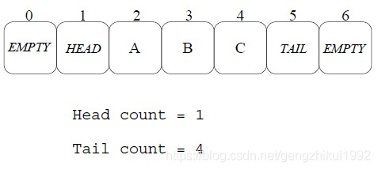
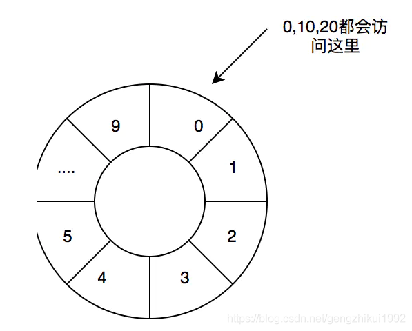

# 无锁数据结构--理解CAS、ABA、环形数组


[网络安全研发随想](https://me.csdn.net/gengzhikui1992) 2019-03-12 16:00:26  641  收藏  1 

分类专栏： [编程](https://blog.csdn.net/gengzhikui1992/category_6036457.html)

版权

在分布式系统中经常会使用到共享内存，然后多个进程并行读写同一块共享内存，这样就会造成并发冲突的问题， 一般的常规做法是加锁，但是锁对性能的影响非常大。

无锁队列是一个非常经典的并行计算数据结构，它极大提升了并发性能。

# CAS同步原语

无锁数据结构依赖很重要的技术就是CAS操作——Compare & Set，或是 Compare & Swap，现在几乎所有的CPU指令都支持CAS的原子操作，X86下对应的是 CMPXCHG 汇编指令。

compare\_and\_swap意思就是说，看一看内存\*reg里的值是不是oldval，如果是的话，则对其赋值newval。

```c
int compare_and_swap (int* reg, int oldval, int newval)
{
  int old_reg_val = *reg;
  if (old_reg_val == oldval)
     *reg = newval;
  return old_reg_val;
}
```

与CAS相似的还有下面的原子操作：

*   Fetch And Add，一般用来对变量做 +1 的原子操作
*   Test-and-set，写值到某个内存位置并传回其旧值。汇编指令BST

# 基于链表实现无锁队列

基本思路是线程间共享一个指向数据结构的指针。

1.  每当一个线程企图修改数据结构的时候，它在线程局部创建一个当前数据结构的拷贝然后做出相应的修改。
2.  完成修改后使用 compare\_and\_swap 来尝试将共享的数据结构指针更新成指向本地拷贝的指针。
3.  如果 compare\_and\_swap 失败则说明有其他线程抢先完成了修改，这个线程将重新读取共享指针并重复拷贝和修改的操作直到 compare\_and\_swap 成功。

```c
EnQueue(x) //进队列
{
    //准备新加入的结点数据
    q = new record();
    q->value = x;
    q->next = NULL;
 
    do {
        p = tail; //取链表尾指针的快照
    } while( CAS(p->next, NULL, q) != TRUE); //如果没有把结点链在尾指针上，再试
 
    CAS(tail, p, q); //置尾结点
}
```

我们再来看看DeQueue的代码

```c
DeQueue(Q) //出队列
{
    do{
        p = Q->head;
        if (p->next == NULL){
            return ERR_EMPTY_QUEUE;
        }
    while( CAS(Q->head, p, p->next) != TRUE );
    return p->next->value;
}
```

# 无锁队列的ABA问题

ABA问题基本是这个样子：

1.  进程P1在共享变量中读到值为A
2.  P1被抢占了，进程P2执行
3.  P2把共享变量里的值从A改成了B，再改回到A，此时被P1抢占。
4.  P1回来看到共享变量里的值没有被改变，于是继续执行。

虽然P1以为变量值没有改变，继续执行了，但是这个会引发一些潜在的问题。ABA问题最容易发生在lock free 的算法中的，CAS首当其冲，因为CAS判断的是指针的值。很明显，值是很容易又变成原样的。

我们可以使用内存计数的方式解决ABA问题

```c
SafeRead(q)
{
    loop:
        p = q->next;
        if (p == NULL){
            return p;
        }

        Fetch&Add(p->refcnt, 1);

        if (p == q->next){
            return p;
        }else{
            Release(p);
        }
    goto loop;
}
```

其中的 Fetch&Add和Release分是是加引用计数和减引用计数，都是原子操作，这样就可以阻止内存被回收了。

# 基于数组实现无所队列–RingBuffer

相比队列的形式，数组更容易实现无锁队列。

*   快速访问
*   不需要频繁分配释放内存

基于数组实现无所队列实现的思路如下：

```c
1）数组队列应该是一个ring buffer形式的数组（环形数组）

2）数组的元素应该有三个可能的值：HEAD，TAIL，EMPTY（当然，还有实际的数据）

3）数组一开始全部初始化成EMPTY，有两个相邻的元素要初始化成HEAD和TAIL，这代表空队列。

4）EnQueue操作。假设数据x要入队列，定位TAIL的位置，使用CAS把(TAIL, EMPTY) 更新成 (x, TAIL)。需要注意，如果找不到(TAIL, EMPTY)，则说明队列满了。

5）DeQueue操作。定位HEAD的位置，把(HEAD, x)更新成(EMPTY, HEAD)，并把x返回。同样需要注意，如果x是TAIL，则说明队列为空。
```

算法的一个关键是——如何定位HEAD或TAIL？

```c
1）我们可以声明两个计数器，一个用来计数EnQueue的次数，一个用来计数DeQueue的次数。

2）这两个计算器使用使用Fetch&ADD来进行原子累加，在EnQueue或DeQueue完成的时候累加就好了。

3）累加后求模就可以知道TAIL和HEAD的位置了。
```

如下图所示：  


采用环形数组的好处：当一个 数据元素被用掉后，其余数据元素不需要移动其存储位置，从而减少拷 贝，提高效率。

环形数组并不是真正的环形数组，在RingBuffer中是采用取余的方式进行访问的，比如数组大小为 10，0访问的是数组下标为0这个位置，其实10，20等访问的也是数组的下标为0的这个位置。  


dpdk就是基于环形数组实现了无锁队列

```c
struct rte_ring {                                                                                                                            
     /* Ring producer status. */                                                                                
     struct prod {                                                                                                
         uint32_t watermark;     /**< Maximum itemsbefore EDQUOT. */                                             
         uint32_t sp_enqueue;    /**< True, if single producer. */                                                
         uint32_t size;          /**< Size of ring.*/                                                           
         uint32_t mask;          /**< Mask (size-1)of ring. */                                                   
         volatile uint32_thead;  /**< Producer head.*/                                                           
         volatileuint32_t tail;  /**< Producer tail.*/                                                           
     } prod __rte_cache_aligned;                                                 
     /* Ring consumer status. */                                                                                
     struct cons {                                                                                                
         uint32_t sc_dequeue;    /**< True, if single consumer. */                                                
         uint32_t size;          /**< Size of thering. */                                                       
         uint32_t mask;          /**< Mask (size-1)of ring. */                                                   
         volatileuint32_t head;  /**< Consumer head.*/                                                           
         volatileuint32_t tail;  /**< Consumer tail.*/                                                                                                                                      
     } cons __rte_cache_aligned;                                                                                  
    void*ring[] __rte_cache_aligned;  
 }

```

整个数据结构分为3个主要部分：生产者状态信息prod；消费者状态信息 cons；消息队列本身(循环 Ring Buffer)每个单元存储着指向报文内容的指针(64bits)。

# 总结

以上基本上就是无锁队列的技术细节，这些技术都可以用在其它的无锁数据结构上。

1.  无锁队列主要是通过CAS、FAA这些原子操作，和Retry-Loop实现。
2.  对于Retry-Loop，其实和自旋锁什么什么两样。只是这种“锁”的粒度变小了，主要是“锁”HEAD和TAIL这两个关键资源。而不是整个数据结构。

参考：  
https://www.zhihu.com/question/23705245  
https://coolshell.cn/articles/8239.html  
https://www.sdnlab.com/21121.html

---------------------------------------------------


原网址: [访问](https://blog.csdn.net/gengzhikui1992/article/details/88422604)

创建于: 2020-09-27 15:12:28

目录: default

标签: `blog.csdn.net`

