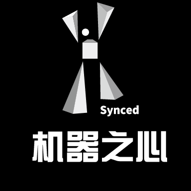

[腾讯技术工程](https://www.jiqizhixin.com/users/7471524c-5c26-4ba1-8679-1a6ce9eafa3a)原创

2019/01/20 14:49

黄日成作者

# 上篇 | 说说无锁(Lock-Free)编程那些事

## 

**1\. 引言**

现代计算机，即使很小的智能机亦或者平板电脑，都是一个多核(多CPU)处理设备，如何充分利用多核CPU资源，以达到单机性能的极大化成为我们码农进行软件开发的痛点和难点。在多核服务器中，采用多进程或多线程来并行处理任务，俨然成为了大家性能调优的标准解决方案。多进程(多线程)的并行编程方式，必然要面对共享数据的访问问题，如何并发、高效、安全地访问共享数据资源，成为并行编程的一个重点和难点。

传统的共享数据访问方式是采用同步原语(临界区、锁、条件变量等)来达到共享数据的安全访问，然而，同步恰恰和并行编程是对立的，很容易成为并行程序中的瓶颈。一方面，有些同步原语是操作系统的内核对象，调用该原语会带来昂贵的上下文切换(用户态切换到内核态)代价，同时，内核对象是一个比较有限的资源。另一方面，同步杜绝了并行操作，一个线程在访问共享数据的时候，其他的多个线程必须在排队空闲等待，同时，同步可扩展性很弱，随着并行线程的增加，很容易成为程序的一个瓶颈，甚至出现，服务性能吞吐量并没随CPU核数增加或并发线程的增加呈现线性增长，相反出现下降的情况。

于是，人们开始研究对共享数据进行并发访问的数据结构和算法，通常有以下几方面：  
\`\`\`  
1\. Transactional memory --- 事务性内存  
2\. Fine-grained algorithms --- 细粒度(锁)算法  
3\. Lock-free data structures --- 无锁数据结构  
\`\`\`  
(1) 事务内存（Transactional memory）TM是一个软件技术，简化了并发程序的编写。 TM借鉴了在数据库社区中首先建立和发展起来的概念， 基本的想法是要申明一个代码区域作为一个事务。一个事务（transaction ） 执行并原子地提交所有结果到内存（如果事务成功），或中止并取消所有的结果（如果事务失败）。 TM的关键是提供原子性（Atomicity），一致性（Consistency ）和隔离性（Isolation ）这些要素。 事务可以安全地并行执行，以取代现有的痛苦和容易犯错误(下面几点)的技术，如锁和信号量。 还有一个潜在的性能优势。 我们知道锁是悲观的（pessimistic ），并假设上锁的线程将写入数据，因此，其他线程的进展被阻塞。 然而访问锁定值的两个事务可以并行地进行，且回滚只发生在当事务之一写入数据的时候。但是，目前还没有嵌入式的事务内存，比较难和传统代码集成，需要软件做出比较大的变化，同时，软件TM性能开销极大，2-10倍的速度下降是常见的，这也限制了软件TM的广泛使用  
\`\`\`  
1\. 因为忘记使用锁而导致条件竞争(race condition)  
2\. 因为不正确的加锁顺序而导致死锁(deadlock)  
3\. 因为未被捕捉的异常而造成程序崩溃(corruption)  
4\. 因为错误地忽略了通知，造成线程无法正常唤醒(lost wakeup)  
\`\`\`  
(2) 细粒度(锁)算法是一种基于另类的同步方法的算法，它通常基于“轻量级的”原子性原语(比如自旋锁)，而不是基于系统提供的昂贵消耗的同步原语。细粒度(锁)算法适用于任何锁持有时间少于将一个线程阻塞和唤醒所需要的时间的场合，由于锁粒度极小，在此类原语之上构建的数据结构，可以并行读取，甚至并发写入。Linux 4.4以前的内核就是采用\_spin\_lock自旋锁这种细粒度锁算法来安全访问共享的listen socket，在并发连接相对轻量的情况下，其性能和无锁性能相媲美。然而，在高并发连接的场景下，细粒度(锁)算法就会成为并发程序的瓶颈所在。  
  
(3) 无锁数据结构，为解决在高并发场景下，细粒度锁无法避免的性能瓶颈，将共享数据放入无锁的数据结构中，采用原子修改的方式来访问共享数据。  
  
目前，常见的无锁数据结构主要有：无锁队列(lock free queue)、无锁容器(b+tree、list、hashmap等)。

  
本文以一个无锁队列实现片段为蓝本，来谈谈无锁编程中的那些事。下面是一个开源C++并发数据结构lib中的无锁队列的实现片段

  
上面是一个普通单向链表队列的无锁实现，对比普通的链表队列实现，无锁实现复杂了很多，多出了很多独有的特征操作：  
\`\`\`  
1\. C++11 标准的原子性操作： load、store、compare\_exchange\_weak、compare\_exchange\_strong  
2\. 一个无限循环： while ( true ) { ... }  
3\. 局部变量的安全性(guards)：t = guard.protect( m\_pTail, node\_to\_value() );  
4\. 补偿策略(functor bkoff)：这不是必须的，但可以在连接很多的情况下缓解处理器的压力，尤其是多个线程逐个地调用队列时。  
5\. helping方法：本例中，dequeue中帮助enqueue将m\_pTail设置正确。  
// It is needed to help enqueue  
m\_pTail.compare\_exchange\_strong( t, pNext, memory\_model::memory\_order\_release,  
                   memory\_model::memory\_order\_relaxed );

  
6\. 标准原子操作中使用的内存模型(memory model)，也就是内存栅栏(屏障)：memory\_order\_release、memory\_order\_acquire等  
\`\`\`  
下面分别讲一下上面提到无锁队列实现中的6个特征。

**2\. 原子性、原子性原语**

我们知道无论是何种情况，只要有共享的地方，就离不开同步，也就是concurrency。对共享资源的安全访问，在不使用锁、同步原语的情况下，只能依赖于硬件支持的原子性操作，离开原子操作的保证，无锁编程(lock-free programming)将变得不可能。  
留意本例的无锁队列的实现例子，我们发现原子性操作可以简单划分为两部分：  
\`\`\`  
1\. 原子性读写(atomic read and write)：本例中的原子load(读)、原子store(写)  
2\. 原子性交换(Atomic Read-Modify-Write -- RMW)：本例中的compare\_exchange\_weak、compare\_exchange\_strong  
\`\`\`  
原子操作可认为是一个不可分的操作；要么发生，要么没发生，我们看不到任何执行的中间过程，不存在部分结果(partial effects)。可以想象的到，原子操作要保证要么全部发生，要么全部没发生，这样原子操作绝对不是一个廉价的消耗低的指令，相反，原子操作是一个较为昂贵的指令。那么在无锁编程中，我们要避免滥用原子操作，那么什么情况下，我们需要对共享变量的操作采用原子操作呢？对变量的普通的读取赋值操作是原子的吗？  
通常情况下，我们有一个对共享变量必须使用原子操作的规则：  
\`\`\`  
任何时刻，只要存在两个或多个线程并发地对同一个共享变量进行操作，并且这些操作中的其中一个是执行了写操作，那么所有的线程都必须使用原子操作。  
\`\`\`  
如果违反上面的规则，即存在某个线程使用了非原子操作，那么你将会陷入一个在C++11标准中称之为数据竞争(data race)（这里的数据竞争和Java中的data race概念，以及更通用的race condition是不一样的）的情形。如果你引发了数据竞争，那么就会得到一个"未定义行为（undefined behavior）"的结果，它们会导致torn reads(撕裂读)和torn writes(撕裂写)，也就是一个非完整的读写。

  
什么样的内存操作是原子的呢？通常情况下，如果一个内存操作使用了多条CPU指令，那么这个内存操作是非原子的。那么只使用一条CPU指令的内存操作是不是就一定是原子的呢？答案是不一定，某些仅仅使用一条CPU的内存操作，在绝大多数CPU架构上是原子，但是，在个别CPU架构上是非原子的。如果，我们想写出可移植的代码，就不能做出使用一条CPU指令的内存操作一定是原子的假设。

  
在C/C++中，所有的内存操作都被假定为非原子性的，即使是普通的32位整形赋值，除非编译器或硬件厂商有特殊说明这个赋值操作是原子的。在所有的现代x86，x64，Itanium，SPARC，ARM和PowerPC处理器中，普通的32位整形，只要内存地址是对齐的，那么赋值操作就是原子操作，这个保证是特定平台下编译器和处理器做出的保证。由于C/C++语言标准并没对整型赋值是原子操作做出保证，于是，要想写出真正可移植的C和C++代码时，我们只能使用C++11提供的原子库( C++11 atomic library)来保证对变量的load(读)和store(写)是原子的。

**2.1 不能不说的关键字：volatile**

通过上面我们知道，在现代处理器中，对于一个对齐的整形类型(整形或指针)，其读写操作是原子的，而对于现代编译器，用volatile修饰的基本类型正确对齐的保障，并且限制了编译器对其优化。这样通过对int变量加上volatile修饰，我们就能对该变量进行原子性读写。  
\`\`\`  
volatile int i=10;//用volatile修饰变量i  
......//something happened  
int b = i;//atomic read  
\`\`\`  
由于volatile 在某种程度上限制了编译器的优化，而很多时候，对于同一个变量，我们在某些地方有原子性读写的需求，在某些地方我们又不需要原子性读写，这个时候希望编译器该优化的时候就优化。然而，不加volatile修饰，那么就做不到前面一点。加了volatile，后面这一方面就无从谈起，怎么办？其实，这里有个小技巧可以达到这个目的：  
\`\`\`  
int i = 2; //变量i还是不用加volatile修饰  
#define ACCESS\_ONCE(x) (\*(volatile typeof(x) \*)&(x))  
#define READ\_ONCE(x) ACCESS\_ONCE(x)  
#define WRITE\_ONCE(x, val) ({ ACCESS\_ONCE(x) = (val); })  
a = READ\_ONCE(i);  
WRITE\_ONCE(i, 2);  
\`\`\`  
通过上面我们知道，用volatile修饰的int在现代处理器中，能够做到原子性的读写，并且限制编译器的优化，每次都是从内存中读取最新的值，很多同学就误以为volatile能够保证原子性并且具有Memery Barrier的作用。其实vloatile既不能保证原子性，也不会有任何的Memery Barrier(内存栅栏)的保证。上面例子中，volatile仅仅是保证int的地址对齐，而对齐后的整形在现代处理器中，是能够做到原子性读写的。在C++中volatile具有以下特性：  
\`\`\`  
1\. 易变性：所谓的易变性，在汇编层面反映出来，就是两条语句，下一条语句不会直接使用上一条语句对应的volatile变量的寄存器内容，而是重新从内存中读取。  
2\. "不可优化"性：volatile告诉编译器，不要对我这个变量进行各种激进的优化，甚至将变量直接消除，保证程序员写在代码中的指令，一定会被执行。  
3\. "顺序性"：能够保证Volatile变量间的顺序性，编译器不会进行乱序优化。Volatile变量与非Volatile变量的顺序，编译器不保证顺序，可能会进行乱序优化。  
\`\`\`  
**2.2 Compare-And-Swap(CAS)**

对于CAS相信大家都不陌生，在学术圈，compare-and-swap (CAS）被认为是最基础的一种原子性RMW操作，其伪代码如下：  
\`\`\`  
bool CAS( int \* pAddr, int nExpected, int nNew )  
atomically {  
if ( \*pAddr == nExpected ) {  
\*pAddr = nNew ;  
return true ;  
}  
else  
return false ;  
}  
\`\`\`  
上面的CAS返回bool告知原子性交换是否成功，然而在有些应用场景中，我们希望CAS 失败后，能够返回内存单元中的当前值，于是就有一个称为 valued CAS的变种，伪代码如下：  
\`\`\`  
int CAS( int \* pAddr, int nExpected, int nNew )  
atomically {  
if ( \*pAddr == nExpected ) {  
\*pAddr = nNew ;  
return nExpected ;  
}  
else  
return \*pAddr;  
}  
\`\`\`  
CAS作为最基础的RMW操作，其他所有RMW操作都可以通过CAS来实现，例如 fetch-and-add(FAA)，伪代码如下：  
\`\`\`  
int FAA( int \* pAddr, int nIncr )  
{  
int ncur = \*pAddr;  
do {} while ( !compare\_exchange( pAddr, ncur, ncur + nIncr ) ;//compare\_exchange失败会返回当前值于ncur  
return ncur ;  
}  
\`\`\`  
在C++11的原子lib中，主要有以下RMW操作：  
\`\`\`  
std::atomic<>::fetch\_add()  
std::atomic<>::fetch\_sub()  
std::atomic<>::fetch\_and()  
std::atomic<>::fetch\_or()  
std::atomic<>::fetch\_xor()  
std::atomic<>::exchange()  
std::atomic<>::compare\_exchange\_strong()  
std::atomic<>::compare\_exchange\_weak()  
\`\`\`  
其中compare\_exchange\_weak()就是最基础的CAS，使用compare\_exchange\_weak()我们可以实现其他所有的RMW操作，C++11 atomic library中的原子RMW操作有点少，不能满足我们实际需求，我们可以自己动手实现自己需要的原子RMW操作。  
例如：我们需要一个原子对内存中值执行乘法，也就是 atomic fetch\_multiply，实现伪代码如下：  
\`\`\`  
uint32\_t fetch\_multiply(std::atomic<uint32\_t>& shared, uint32\_t multiplier)  
{  
uint32\_t oldValue = shared.load();  
while (!shared.compare\_exchange\_weak(oldValue, oldValue \* multiplier))  
{  
}  
return oldValue;  
}  
\`\`\`  
以上的原子RMW操作都是只能对一个integer变量进行原子修改操作，如果我们想同时对两个integer变量进行原子操作，怎么实现呢？我们知道C++11的原子库std::atomic<>是一个模版，这样我们可以用一个结构体来包含两个integer变量，来对结构体进行原子修改，实现如下：  
\`\`\`  
struct Terms  
{  
uint32\_t x;  
uint32\_t y;  
};  
std::atomic<Terms> terms;  
  
void atomicFibonacciStep()  
{  
Terms oldTerms = terms.load();  
Terms newTerms;  
do  
{  
newTerms.x = oldTerms.y;  
newTerms.y = oldTerms.x + oldTerms.y;  
}  
while (!terms.compare\_exchange\_weak(oldTerms, newTerms));  
}  
\`\`\`  
到这里，可能大家会有疑问了，是不是terms.compare\_exchange\_weak(oldTerms, newTerms)在内部加了锁，要不怎么能够原子修改呢？

  
C++11的原子库std::atomic<> template可以是任何类型(int、bool等buil-in type，或user-defined type)，但并不是所有的类型的原子操作是lock-free的。C++11 标准库 std::atomic 提供了针对整形(integral)和指针类型的特化实现，其中 integal 代表了如下类型char, signed char, unsigned char, short, unsigned short, int, unsigned int, long, unsigned long, long long, unsigned long long, char16\_t, char32\_t, wchar\_t，这些特化实现，都包含了一个is\_lock\_free()成员来用于判断该原子类型是原子操作是否是lock-free的。

  
上面的例子中，在X64平台下，用GCC4.9.2编译出来的代码terms.compare\_exchange\_weak(oldTerms, newTerms)是lock-free的，在其他平台下就不能保证了。在实际应用中，通常情况下，同时满足以下条件的原子类的原子操作才能做出是lock-free的保证：  
\`\`\`  
1\. The compiler is a recent version MSVC, GCC or Clang.  
2\. The target processor is x86, x64 or ARMv7 (and possibly others).  
3\. The atomic type is std::atomic<uint32\_t>, std::atomic<uint64\_t> or std::atomic<T\*> for some type T.  
\`\`\`  
**2.3 Weak and Strong CAS**

相信大家看到C++11的CAS操作有两个compare\_exchange\_weak和compare\_exchange\_strong，CAS怎么还有强弱之分呢？现代处理器架构对CAS的实现分成两大阵营：(1)实现了原子性CAS原语 -- X86、Intel Itanium、Sparc等处理器架构，最早实现于IBM System 370。(2)实现LL/SC对(load-linked/store-conditional) --  PowerPC, MIPS, Alpha, ARM 等处理器架构，最早实现于DEC，通过LL/SC对可以实现原子性CAS，但在一些情况下它并不具有原子性。为什么会存在LL/SC对的使用，而不直接实现CAS原语呢？要说明LL/SC对存在的原因，不得不说一下无锁编程中的一个棘手问题：ABA问题。

**2.3.1 ABA问题**

下面无锁堆栈的实现片段：  
\`\`\`  
// Shared variables  
static NodeType \* Top = NULL; // Initially null  
  
Push(NodeType \* node) {  
do {  
/\*Push1\*/ NodeType \* t = Top;  
/\*Push2\*/ node->Next = t;  
/\*Push3\*/ } while ( !CAS(&Top,t,node) );  
}  
  
NodeType \* Pop() {  
Node \* next ;  
do {  
/\*Pop1\*/ NodeType \* t = Top;  
/\*Pop2\*/ if ( t == null )  
/\*Pop3\*/ return null;  
/\*Pop4\*/ next = t->Next;  
/\*Pop5\*/ } while ( !CAS(&Top,t,next) );  
/\*Pop6\*/ return t;  
}  
\`\`\`  
假设当前堆栈有4个成员是：A-->B-->C-->D，A位于栈顶。下面的一个执行时序会导致一个栈被破坏的ABA问题：  
\`\`\`  
1\. Thread X执行Pop()操作，并在执行完/\*Pop4\*/这行代码后Thread X被切出去，这个时候对于Thread X来说， t == A； next == A->next == B；Top == A；当前栈：A-->B-->C-->D  
2\. Thread Y 执行NodeType \* pTop=Pop()操作，接着又执行Pop(),最后执行Push(pTop)。这个时候当前栈变成了：A-->C-->D。  
3\. 这个时候Thread X被调度执行/\*Pop5\*/这行代码，由于栈顶元素依然是A，于是CAS(&Top,t,next)执行成功，Top变成指向了B，栈顶指针指向了一个已经不再栈中的元素B，整个栈被破坏了。  
\`\`\`  
通过这个例子，我们知道ABA问题是所有基于CAS的无锁容器的一个灾难问题，要解决ABA问题有两个思路：  
\`\`\`  
1\. 不要重用容器中的元素，本例中，Pop出来的A不要直接Push进容器，应该new一个新的元素A\_n出来然后在push进容器中。当然new一个新的元素也不绝对安全，如果是A先被delete了，接着调用new来new一个新的元素有可能会返回A的地址，这样还是存在ABA的风险。一般对于无锁编程中的内存回收采用延迟回收的方式，在确保被回收内存没有被其他线程使用的情况下安全回收内存。

  
2\. 允许内存重用，对指向的内存采用标签指针(Tagged Pointers)的方式，标签作为一个版本号，随着标签指针上的每一次CAS运算而增加，并且只增不减。本例中，如果采用标签指针方式，Tread X的t指向Top的时候Top的标签为T1，这个时候t == A并且标签是T1。随后Tread Y执行Pop()，Pop()，Push(),Top至少进过了3次CAS，标签变成了T1+3，于是Top == A并且标签是T1+3，这样在Thread X被调度执行/\*Pop5\*/这行代码的时候，虽然t == Top == A，但是标签不一样，于是CAS会失败，这样栈就不会被破坏了。  
\`\`\`  
**2.3.2 Load-Linked / Store-Conditional -- LL/SC对**

通过上面我们知道，ABA问题的本质在于，CAS进行比较的是指针指向的内存地址，虽然在/\\\*Pop1\\\*/行读取Top指向的内存地址，到/\\\*Pop5\\\*/行的CAS，t和Top都是指向A的内存地址，但是A内存里面的内容已经发生过变化了(A的next变成了C)。如果处理器能够感知得到在进行CAS的内存地址的内如发生了变化，让CAS失败的话，那么就能从源头上解决ABA问题。于是PowerPC, MIPS, Alpha, ARM 等处理器架构的开发人员找到了load-linked、store-conditional (LL/SC) 这样的操作对来彻底解决ABA问题，伪代码如下：  
\`\`\`  
word LL( word \* pAddr ) {  
return \*pAddr ;  
}  
  
bool SC( word \* pAddr, word New ) {  
if ( data in pAddr has not been changed since the LL call) {  
\*pAddr = New ;  
return true ;  
}  
else  
return false ;  
}  
\`\`\`  
LL/SC对以括号运算符的形式运行，Load-linked（LL） 运算仅仅返回 pAddr 地址的当前变量值。如果 pAddr 中的内存数据在读取之后没有变化，那么 Store-conditional（SC）操作将会成功，它将LL读取 pAddr 地址的存储新的值，否则，SC将执行失败。这里的pAddr中的内存数据是否变化指的是pAddr地址所在的Cache Line是否发生变化。在实现上，处理器开发者给每个Cahce Line添加额外的比特状态值（status bit）。一旦LL执行读运算，就会关联此比特值。任何的缓存行一旦有写入，此比特值就会被重置；在存储之前，SC操作会检查此比特值是否针对特定的缓存行。如果比特值为1，意味着缓存行没有任何改变，pAddr 地址中的值会变更为新值，SC操作成功。否则本操作就会失败，pAddr 地址中的值不会变更为新值。  
CAS通过LL/SC对得以实现，伪代码如下：  
\`\`\`  
bool CAS( word \* pAddr, word nExpected, word nNew ) {  
if ( LL( pAddr ) == nExpected )  
return SC( pAddr, nNew ) ;  
return false ;  
}  
\`\`\`  
可以看到通过LL/SC对实现的CAS并不是一个原子性操作，但是它确实执行了原子性的CAS，目标内存单元内容要么不变，要么发生原子性变化。由于通过LL/SC对实现的CAS并不是一个原子性操作，于是，该CAS在执行过程中，可能会被中断，例如：线程X在执行LL行后，OS决定将X调度出去，等OS重新调度恢复X之后，SC将不再响应，这时CAS将返回false，CAS失败的原因不在数据本身(数据没变化)，而是其他外部事件(线程被中断了)。  
正是因为如此，C++11标准中添入两个compare\_exchange原语-弱的和强的。也因此这两原语分别被命名为compare\_exchange\_weak和compare\_exchange\_strong。即使当前的变量值等于预期值，这个弱的版本也可能失败，比如返回false。可见任何weak CAS都能破坏CAS语义，并返回false，而它本应返回true。而Strong CAS会严格遵循CAS语义。  
那么，何种情形下使用Weak CAS，何种情形下使用Strong CAS呢？通常执行以下原则：  
\`\`\`  
倘若CAS在循环中（这是一种基本的CAS应用模式），循环中不存在成千上万的运算（循环体是轻量级和简单的,本例的无锁堆栈），使用compare\_exchange\_weak。否则，采用强类型的compare\_exchange\_strong。  
\`\`\`  
**2.3.3 False sharing(伪共享)**

现代处理器中，cache是以cache line为单位的，一个cache line长度L为64-128字节，并且cache line呈现长度进一步增加的趋势。主存储和cache数据交换在 L 字节大小的 L 块中进行，即使缓存行中的一个字节发生变化，所有行都被视为无效，必需和主存进行同步。存在这么一个场景，有两个变量share\_1和share\_2，两个变量内存地址比较相近被加载到同一cahe line中，cpu core1 对变量share\_1进行操作，cpu core2对变量share\_2进行操作，从cpu core2的角度看，cpu core1对share\_1的修改，会使得cpu core2的cahe line中的share\_2无效，这种场景叫做False sharing(伪共享)。

由于LL/SC对比较依赖于cache line，当出现False sharing的时候可能会造成比较大的性能损失。加载连接（LL）操作连接缓存行，而存储状态（SC)）操作在写之前，会检查本行中的连接标志是否被重置。如果标志被重置，写就无法执行，SC返回 false。考虑到cache line比较长，在多核cpu中，cpu core1在一个while循环中变量share\_1执行CAS修改，而其他cpu corei在对同一cache line中的变量share\_i进行修改。在极端情况下会出现这样的一个livelock(活锁)现象：每次cpu core1在LL(share\_1)后，在准备进行SC的时候，其他cpu core修改了同一cache line的其他变量share\_i，这样使得cache line发生了改变，SC返回false，于是cpu core1又进入下一个CAS循环，考虑到cache line比较长，cache line的任何变更都会导致SC返回false，这样使得cup core1在一段时间内一直在进行一个CAS循环，cpu core1都跑到100%了，但是实际上没做什么有用功。

为了杜绝这样的False sharing情况，我们应该使得不同的共享变量处于不同cache line中，一般情况下，如果变量的内存地址相差住够远，那么就会处于不同的cache line，于是我们可以采用填充（padding）来隔离不同共享变量，如下：  
\`\`\`  
struct Foo {  
int volatile nShared1;  
char \_padding1\[64\]; // padding for cache line=64 byte  
int volatile nShared2;  
char \_padding2\[64\]; // padding for cache line=64 byte  
};  
\`\`\`  
上面，nShared1和nShared2就会处于不同的cache line，cpu core1对nShared1的CAS操作就不会被其他core对nShared2的修改所影响了。

  
上面提到的cpu core1对share\_1的修改会使得cpu core2的share\_2变量的cache line失效，造成cpu core2需重新加载同步share\_2；同样，cpu core2对share\_2变量的修改，也会使得cpu core1所在的cache line实现，造成cpu core1需要重新加载同步share\_1。这样cpu core1的一个修改造成cpu core2的一个cache miss，cpu core2的一个修改造成cpu core1的一个cache miss的反复现象就是所谓的Cache ping-pong问题，出现大量Cache ping-pong意味着大量的cache miss，会造成巨大的性能损失。我们同样可以采用填充（padding）来隔离不同共享变量来解决cache ping-pong。

**3 局部变量的安全性**

通过上面，我们知道实现无锁数据结构在内存使用上存在两个棘手的问题：一是ABA问题，二是内存安全回收问题。这两个问题之间联系比较密切，但是鲜有两全其美的办法，同时解决这两大难题，通常采用各个击破，分别予以解决。

有种从根源上解决这个问题的方法，那就是不产生这两个问题，对于无锁队列来说，我们可以实现一个定长无锁队列，队列在初始化的时候确定好队列的大小n，这样一次性分配好所需的内存(n \* sizeof(node))。

定长无锁队列将一块连续的内存分割成n个小内存块block，每个内存块block可以存储一个队列node(当然在队列node过大的情况下，可以用连续的几个内存块来存储一个队列node)。通过head和tail两个指针来进行队列node的入队和出队，从head到tail是已经被使用的内存block(被已入队的队列node占用)，从tail到head之间是空闲内存block。入队的时候，首先原子修改tail指针(tail指针向后移动若干block)，占据需要使用的block，然后往blcok中写入队列node。出队的时候，首先原子修改head指针(head指针向后移动若干block)，占据需要读取的block，然后从block中读取队列node。

定长无锁队列不存在内存的分配和回收问题，同时内存block的位置固定，像一个环形buf一直在循环读写使用，不存在ABA问题。定长无锁队列存在一个队列元素读写完整性问题，由于入队采用的是先入队在写入内容的方式，于是存在队列node内容还没写入完毕就会被出队读取了，读取到一个不完整的node。同样，出队采用先出队，在读取队列node内容，于是也存在内容还没读取的时候，被新的队列node入队的内容给覆盖了。要解决这个问题不复杂，只要给每个队列node加上一个tag标记是否已经写入完毕、是否已经读取完毕即可。

定长无锁队列虽然不存在ABA问题和内存安全回收问题，但是由于其队列是定长的，扩展性比较差。对于ABA问题的解决方案，前面已经介绍了标签指针（Tagged pointers）和LL/SC对两种解决方案。下面着重介绍以下内存安全回收的解决方案。

内存安全回收问题根源上是待回收的内存还被其他线程引用中，此时如果delete该内存，那么引用该内存的线程就会出现使用非法内存的问题，那么我们只能延迟回收该内存，即在安全时刻再delete。目前用于lock free代码的内存回收的经典方法有：Lock Free Reference Counting、Hazard Pointer、Epoch Based Reclamation、Quiescent State Based Reclamation等。

**3.1 Epoch Based Reclamation(基于周期的内存回收)**

Epoch Based方法采用递增的方式来维护记录当前正在被引用的内存版本ver\_i，如果能知道当前被引用的的内存的最小版本ver\_min，那么我们就可以安全回收所有内存版本小于ver\_min的内存了。通常不会给一个内存对象一个版本，这样版本太多，难以管理，一个折中方案是一个周期内的内存对象都是分配同一个版本ver\_p。那么，最少需要几个不同版本呢？一个版本是肯定不可以的，这样就无法区分哪些内存对象是可以安全回收的，哪些是暂时不能回收的。两个版本ver\_0、ver\_1是否OK呢？假设当前的内存对象都被分配版本号ver\_0，在某一个时刻t1，我们决定变更版本号为ver\_1，这样新的内存对象就被分配版本ver\_1。这样才t1后，在我们再次变更版本号为ver\_0前，版本号为ver\_0的内存对象就不再增加了。那么，在所有使用版本号为ver\_0的内存对象的线程都不再使用这些内存对象后，假设这个时候是t2，这时我们就可以开始回收版本号ver\_0的内存对象，回收耗时k\*n(n是待回收的内存对象)。很明显，我们再次变更版本号为ver\_0的时刻t3是一定要大于等于t2+k\*n时刻的，因为，如果t3<t2+k\*n，那么在t2+k\*n至t3间产生的版本号为的对象就会存在非安全回收的风险。

可以看出采用两个版本是ok的，但是细心的同学会发现，这样的回收粒度有点粗，版本号为ver\_1的内存对象在t1至t2+k\*n这段时间内一直在增长，整个时间长度依赖于内存对象被引用的时间和ver\_0的内存对象被回收的时间，这样可能会引起滚雪球效应，越往后面回收时间会越长。

通过上面的分析，我们知道，如果想版本号变更的时间点不依赖ver\_0的内存对象被回收的时间，我们需要增加一个版本号ver\_2，那么在t2时刻，我们就可以切换版本号为ver\_2，同时可以启动回收ver\_0的内存对象。

通过上面的分析，Epoch Based算法维护了一个全局的epoch(取值为0、1、2)和三个全局的retire\_list（每个全局的epoch对应一个retire list, retire list 存放逻辑删除后待回收的节点指针）。除此之外我们为每个线程维护一个局部的thread\_active flag(这个用来标识thread时候已经不再引用该epoch值的内存对象)和thread\_epoch(取值自然也为0、1、2)。算法如下：  
\`\`\`  
#define N\_THREADS 4 //假设一共4个线程  
const EPOCH\_COUNT = 3 ;  
bool active\[N\_THREADS\] = {false};  
int epoches\[N\_THREADS\] = {0};  
int global\_epoch = 0;  
vector<int\*> retire\_list\[3\];  
void read(int thread\_id)  
{  
active\[thread\_id\] = true;  
epoches\[thread\_id\] = global\_epoch;  
//进入临界区了。可以安全的读取  
//......  
//读取完毕，离开临界区  
active\[thread\_id\] = false;  
}  
void logical\_deletion(int thread\_id)  
{  
active\[thread\_id\] = true;  
epoches\[thread\_id\] = global\_epoch;  
//进入临界区了，这里，我们可以安全的读取  
//好了，假如说我们现在要删除它了。先逻辑删除。  
//而被逻辑删除的tmp指向的节点还不能马上被回收，因此把它加入到对应的retire list  
retire\_list\[global\_epoch\].push\_back(tmp);  
//离开临界区  
active\[thread\_id\] = false;  
//看看能不能物理删除  
try\_gc();  
}  
bool try\_gc()  
{  
int &e = global\_epoch;  
for (int i = 0; i < N\_THREADS; i++) {  
if (active\[i\] && epoches\[i\] != e) {  
//还有部分线程没有更新到最新的全局的epoch值  
//这时候可以回收(e + 1) % EPOCH\_COUNT对应的retire list。  
free((e + 1) % EPOCH\_COUNT);//不是free(e)，也不是free(e-1)。  
return false;  
}  
}  
//更新global epoch  
e = (e + 1) % EPOCH\_COUNT;  
//更新之后，那些active线程中，部分线程的epoch值可能还是e - 1（模EPOCH\_COUNT）  
//那些inactive的线程，之后将读到最新的值，也就是e。  
//不管如何，(e + 1) % EPOCH\_COUNT对应的retire list的那些内存，不会有人再访问到了，可以回收它们了  
//因此epoch的取值需要有三种，仅仅两种是不够的。  
free((e + 1) % EPOCH\_COUNT);//不是free(e)，也不是free(e-1)。  
}  
bool free(int epoch)  
{  
for each pointer in retire\_list\[epoch\]  
if (pointer is not NULL)  
delete pointer;  
}  
\`\`\`  
Epoch Based Reclamation算法规则比较简单明了，该算法规则有个重要的缺陷是，它依赖于所有使用ver\_0的内存对象的线程都进入到下个周期ver\_1后，ver\_0的内存对象才能被回收。只要有一个线程未能进入到下个周期ver\_1，那么那些大多数已经没有引用的ver\_0内存对象就不能被删除回收。这个在线程存在不同的优先级时候，优先级低的线程会导致优先级高的线程延迟待删除元素增长变得不可控，一旦某个线程一直无法进入下一个周期，会导致无限的内存消耗。  
  
**3.2 险象指针（Hazard pointer）**

Hazard Pointer由Maged M. Michael在论文"Hazard Pointers: Safe Memory Reclamation for Lock-Free Objects"中提出，基本思路是将可能要被访问到的共享对象指针（成为hazard pointer）先保存到线程局部，然后再访问，访问完成后从线程局部移除。而要释放一个共享对象时，则要先遍历查询所有线程的局部信息，如果尚有线程局部保存有这个共享对象的指针，说明这个线程有可能将要访问这个对象，因此不能释放，只有所有线程的局部信息中都没有保存这个共享对象的指针情况下，才能将其释放。  
我们知道Hazard Pointer封装了原始指针，那么Hazard Pointer的内存和生命周期本身如何管理呢？以下是常见的策略：  
\`\`\`  
1，Hazard Pointer本身的内存只分配，不释放。在stack、queue等数据结构里，需要的Hazard Pointer数量一般为1或者2，所以不释放问题不大。对于skip list这种数据结构又有遍历需求的，那么Hazard Pointer可能就不是非常适用了，可以考虑使用Epoch Based Reclamation技术。据我所知，这也是memsql使用的内存回收策略。  
  
2，每个线程拥有、管理自己的retire list和hazard pointer list ，而不是所有线程共享一个retire list，这样可以避免维护retire list和hazard pointer list的开销，否则我们可能又得想尽脑汁去设计另外一套lock free的策略来管理这些list，先有鸡先有蛋，无穷无尽。所谓retire list就是指逻辑删除后待物理回收的指针列表。  
  
3，每个线程负责回收自己的retire list中记录维护的内存。这样，retire list是一个线程局部的数据结构，自己写，自己读，吃自己的狗粮。  
  
4，只有当retire list的大小（数量）达到一定的阈值时，才进行GC。这样，可以把GC的开销进行分摊，同时，应该尽可能使用Jemalloc或者TCmalloc这些高效的、带线程局部缓存的内存分配器。  
\`\`\`

**3.3 Hazard Version**

HazardPointer的实现简单，但是其有个不足：需要为每个共享变量维护一个线程的hazard pointer，这样使用者需要仔细分析算法以尽量减少同时存在的hazard pointer，Hazard Pointer机制也与具体数据结构的实现比较紧的耦合在一起，对于skip list这样的有遍历需求的数据结构同时存在的hazard pointer很容易膨胀比较多，内存使用是个问题。

因此在Hazard Pointer基础上发展出了被称为Hazard Version技术，它提供类似lock一样的acquire/release接口，支持无限制个数共享对象的管理。

与Hazard Pointer的实现不同：首先全局要维护一个int64\_t类型的GlobalVersion；要访问共享对象前，先将当时的GlobalVersion保存到线程局部，称为hazard version；而每次要释放共享对象的时候先将当前GlobalVersion保存在共享对象，然后将GlobalVersion原子的加1，然后遍历所有线程的局部信息，找到最小的version称为reclaim version，判断如果待释放的对象中保存的version小于reclaim version则可以释放。hazard version就类似于给每个内存对象分配一个单调递增的version的Epoch Based方法，是更细粒度的内存回收。

**4 补偿策略(functor bkoff)**

补偿策略通常作为避免大量CAS竞争的一种退避策略，在大并发修改同一变量的情况下，能有效缓解CPU压力。考虑这么一个场景，N个线程同时对一个无锁队列进行入队操作，于是同时进行的N个CAS操作，最终只有一个线程返回成功。于是，失败的N-1个线程在下一个循环中继续重试同时进行N-1个CAS操作，最终还是只有一个线程返回成功。这样一直下去，大量的CPU被消耗在无用的CAS操作上，我们知道CAS操作是一个很重的一个操作，服务器性能会急剧下降。这好比来自四面八方的车辆汇聚到一个出口，大家都比较自私的想要最快通过的话，那么这个路口会被堵的水泄不通，理想的情况是将车辆流水线化，这样大家都能较快通过出口。然而实际情况是比较难流水线化的，于是，我们采用礼让的方式，在尝试通过路口发现堵塞的时候，就delay一小会在尝试通过。一个简单的实现如下：  
\`\`\`  
bkoof()  
{  
static const int64\_t INIT\_LOOP = 1000000;  
static const int64\_t MAX\_LOOP = 8000000;  
static \_\_thread int64\_t delay = 0;  
if (delay <= 0) {  
delay = INIT\_LOOP;  
}  
for (int64\_t i = 0; i < delay; i++) {  
CPU\_RELAX();  
}  
int64\_t new\_delay = delay << 1LL;  
if (new\_delay <= 0 || new\_delay >= MAX\_LOOP) {  
new\_delay = INIT\_LOOP;  
}  
delay = new\_delay;  
}  
}  
\`\`\`

**5 helping方法**

  

  

Helping方法是一种广泛存在于无锁算法中的方法，特别是在一个线程帮助其它线程去执行任务场景中。本例中的无锁队列实现，会出现m\_pTail的暂时错位不正确，主要的原因是m\_pTail的修改(如下)并不能保证一定成功。

\`\`\`  
m\_pTail.compare\_exchange\_strong( t, pNew, memory\_model::memory\_order\_acq\_rel,  
memory\_model::memory\_order\_relaxed );  
\`\`\`  
这里为什么不重试让m\_pTail指向正确的位置呢？这里主要是实现策略和成本开销的问题，考虑这么一个场景：  
\`\`\`  
1\. 当前时刻队列有3个节点(A-->B-->C)，队列状态：m\_pHead->m\_pNext == A，m\_pTail == C  
2\. 这时线程1执行入队enqueue(D)，线程2执行入队enqueue(E)。  
3\. 线程1执行enqueue(D)进行到最后一步，这时队列状态：(A-->B-->C-->D)，m\_pHead->m\_pNext == A，m\_pTail == C  
4\. 线程2执行enqueue(E)，这时它发现m\_pTail->m\_pNext != NULL，m\_pTail位置不正确了。  
\`\`\`  
这个时候，线程2有两个选择：(1) 不断重试等待线程1将m\_pTail设置正确后，自己在进行下面的操作步骤。(2) 顺路帮线程1一把，自己将m\_pTail调整到正确位置，然后在进行下面的操作步骤。如果采用(1)，线程2可能会进入一个较漫长的等待来等线程1完成m\_pTail 的设置。采用(2)则是一个双赢的局面，线程2不在需要等待和依赖线程1，线程1也不再需要在m\_pTail设置失败的时候进行重试了。  
  
第6章的内容将在本次推送的第二条图文《说说无锁（Lock-Free）编程那些事（下）》中阐述。

_**参考资料**_

_http://chonghw.github.io/  
http://chonghw.github.io/blog/2016/08/11/memoryreorder/  
http://chonghw.github.io/blog/2016/09/19/sourcecontrol/  
http://chonghw.github.io/blog/2016/09/28/acquireandrelease/  
http://www.wowotech.net/kernel\_synchronization/Why-Memory-Barriers.html  
http://www.wowotech.net/kernel\_synchronization/why-memory-barrier-2.html  
http://www.wowotech.net/kernel\_synchronization/memory-barrier-1.html  
http://www.wowotech.net/kernel\_synchronization/perfbook-memory-barrier-2.html  
https://kukuruku.co/post/lock-free-data-structures-introduction/  
https://kukuruku.co/post/lock-free-data-structures-basics-atomicity-and-atomic-primitives/  
https://kukuruku.co/post/lock-free-data-structures-the-inside-memory-management-schemes/_

[

腾讯技术工程

腾讯技术工程事业群在机器之心的内容专栏

](https://www.jiqizhixin.com/columns/TEG)

[入门](https://www.jiqizhixin.com/categories/basic)无锁

[3](javascript:)

相关数据

[IBM](https://pro.jiqizhixin.com/database/institutions/b86983cf-b858-45b0-86a1-b05cb94cde08)机构

[感知](https://pro.jiqizhixin.com/database/wiki_knowledge/1ccbfcc7-1b56-44d6-b64b-729d855abcb1)技术

[调度](https://pro.jiqizhixin.com/database/wiki_knowledge/1ef8dd91-7c80-46f2-811e-0722d3d333d4)技术

[伪代码](https://pro.jiqizhixin.com/database/wiki_knowledge/5796887d-ff61-4bb5-8cb1-201201bd42e9)技术

[数据库](https://pro.jiqizhixin.com/database/wiki_knowledge/700f9c0f-1e8b-4fde-8bae-6de39c13f022)技术

展开全部数据

推荐文章

[下篇 | 说说无锁(Lock-Free)编程那些事（下）](https://www.jiqizhixin.com/articles/2019-01-22-13)

[腾讯技术工程](https://www.jiqizhixin.com/users/7471524c-5c26-4ba1-8679-1a6ce9eafa3a)[3](javascript:)

[手把手：四色猜想、七桥问题…程序员眼里的图论，了解下？（附大量代码和手绘）](https://www.jiqizhixin.com/articles/2018-05-29-10)

[大数据文摘](https://www.jiqizhixin.com/users/b935793e-0a5c-46e1-8bd4-cd8ca2cbe7b9)[3](javascript:)

[从七桥问题开始：全面介绍图论及其应用](https://www.jiqizhixin.com/articles/2018-03-11-2)

[机器之心](https://www.jiqizhixin.com/users/7f316f0c-8f72-4231-bb30-0eb1dd5a5660)[25](javascript:)

---------------------------------------------------

原网址: [访问](https://www.jiqizhixin.com/articles/2019-01-22-12)

创建于: 2020-09-27 15:54:44

目录: default

标签: `www.jiqizhixin.com`

