# 下篇 | 说说无锁(Lock-Free)编程那些事（下）

## 下篇 | 说说无锁(Lock-Free)编程那些事（下）

黄日成 [腾讯技术工程](javascript:) _2019-01-18_

  

  

  

**6 内存屏障（Memory Barriers）**

**6.1 What Memory Barriers？**  
内存屏障，也称内存栅栏，内存栅障，屏障指令等，是一类同步屏障指令，是CPU或编译器在对内存随机访问的操作中的一个同步点，使得此点之前的所有读写操作都执行后才可以开始执行此点之后的操作。大多数现代计算机为了提高性能而采取乱序执行，这使得内存屏障成为必须。语义上，内存屏障之前的所有写操作都要写入内存；内存屏障之后的读操作都可以获得同步屏障之前的写操作的结果。因此，对于敏感的程序块，写操作之后、读操作之前可以插入内存屏障。

  
通常情况下，我们希望我们所编写的程序代码能"所见即所得"，即程序逻辑满足程序的顺序性(满足program order)，然而，很遗憾，我们的程序逻辑("所见")和最后的执行结果("所得")隔着：  
\`\`\`  
1\. 编译器  
2\. CPU取指执行  
\`\`\`  
1. 编译器将符合人类思考的逻辑（程序代码）翻译成了符合CPU运算规则的汇编指令，编译器了解底层CPU的思维模式，因此，它可以在将程序翻译成汇编的时候进行优化（例如内存访问指令的重新排序），让产出的汇编指令在CPU上运行的时候更快。然而，这种优化产出的结果未必符合程序员原始的逻辑，因此，作为程序员，必须有能力了解编译器的行为，并在通过内嵌在程序代码中的memory barrier来指导编译器的优化行为（这种memory barrier又叫做优化屏障，Optimization barrier），让编译器产出即高效，又逻辑正确的代码。

  
2. CPU的核心思想就是取指执行，对于in-order的单核CPU，并且没有cache，汇编指令的取指和执行是严格按照顺序进行的，也就是说，汇编指令就是所见即所得的，汇编指令的逻辑严格的被CPU执行。然而，随着计算机系统越来越复杂（多核、cache、superscalar、out-of-order），使用汇编指令这样贴近处理器的语言也无法保证其被CPU执行的结果的一致性，从而需要程序员告知CPU如何保证逻辑正确。  
  
综上所述，memory barrier是一种保证内存访问顺序的一种方法，让系统中的HW block（各个cpu、DMA controler、device等）对内存有一致性的视角。

  
通过上面介绍，我们知道我们所编写的代码会根据一定规则在与内存的交互过程中发生乱序。内存执行顺序的变化在编译器(编译期间)和cpu(运行期间)中都会发生，其目的都是为了让代码运行的更快。就算是为了性能而乱序，但是乱序总有个度吧(总不能将指针的初始化的代码乱序在使用指针的代码之后吧，这样谁还敢写代码)。编译器开发者和cpu厂商都遵守着内存乱序的基本原则，简单归纳如下：  
\`\`\`  
不能改变单线程程序的执行行为 -- 但线程程序总是满足Program Order(所见即所得)  
\`\`\`  
在此原则指导下，写单线程代码的程序员不需要关心内存乱序的问题。在多线程编程中，由于使用互斥量，信号量和事件都在设计的时候都阻止了它们调用点中的内存乱序(已经隐式包含各种memery barrier)，内存乱序的问题同样不需要考虑了。只有当使用无锁(lock-free)技术时–内存在线程间共享而没有任何的互斥量，内存乱序的效果才会显露无疑，这样我们才需要考虑在合适的地方加入合适的memery barrier。

  

**6.1.1 编译期乱序**  
考虑下面一段代码：  
\`\`\`  
int Value = 0;  
int IsPublished = 0;  
   
void sendValue(int x)  
{  
    Value = x;  
    IsPublished = 1;  
}  
  
int tryRecvValue()  
{  
    if (IsPublished)  
    {  
        return Value;  
    }  
    return -1;  // or some other value to mean not yet received  
}  
\`\`\`  
在出现编译期乱序的时候，sendValue可能变成如下：  
\`\`\`  
void sendValue(int x)  
{  
    IsPublished = 1;  
    Value = x;  
}  
\`\`\`  
对于但线程而言，这样的乱序是不会有影响的，因为sendValue(10)调用后，IsPublished == 1; Value == 10；这时调用tryRecvValue()就会得到10和乱序前是一样的结果。但是对于多线程，线程1调用sendValue(10)， 线程2调用tryRecvValue()，当线程1执行完IsPublished = 1;的时候，线程2调用tryRecvValue()就会得到Value的初始默认值0，这和程序原本逻辑违背，于是我们必须加上编译器的barrier来防止编译器的乱序优化：  
\`\`\`  
#define COMPILER\_BARRIER() asm volatile("" ::: "memory")  
  
int Value;  
int IsPublished = 0;  
  
void sendValue(int x)  
{  
    Value = x;  
    COMPILER\_BARRIER();          // prevent reordering of stores  
    IsPublished = 1;  
}  
  
int tryRecvValue()  
{  
    if (IsPublished)  
    {  
        COMPILER\_BARRIER();      // prevent reordering of loads  
        return Value;  
    }  
    return -1;  // or some other value to mean not yet received  
}  
\`\`\`  
下面也是一个编译器乱序的例子(在Gcc4.8.5下 gcc -O2 -c -S compile\_reordering.cpp)：  

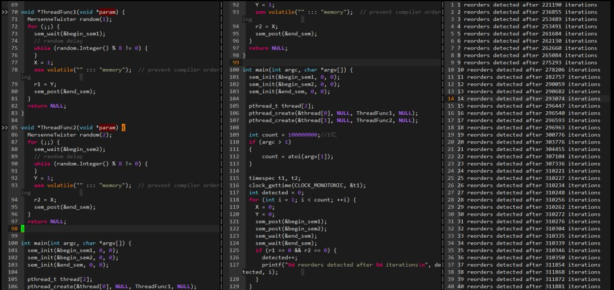

  

可以看出，在开启-o2编译器优化选项时，内存会发生乱序，在写变量A之前会先写变量B。  

  

**6.1.2 运行期乱序**  
下面看一个运行期CPU乱序的例子：  

  

可以看出在22W多次迭代后检测到一次乱序，乱序间隔在摇摆不定。  
  
**6.2 Why Memory Barriers？**  

6.2.1 现代处理器cache架构  
通过上面，我们知道存在两种类型的Memory Barriers：编译器的Memory Barrier、处理器的Memory Barrier。对于编译器的Memory Barrier比较好理解，就是防止编译器为了优化而将代码执行调整乱序。而处理器的Memory Barrier是防止CPU怎样的乱序呢？CPU的内存乱序是怎么来的？  
乱序会有问题本质上是读到了老的数据，或者是一部分读到新的一部分读到老的数据，例如：上面的例子中，已经读到了IsPublished的新值，却还是读到了Value老的值，从而引起问题。这种数据不一致怎么来的呢？相信这个时候大家脑海里已经浮现出一个词了：Cache。

  
首先我们来看看现代处理器基本的cache架构

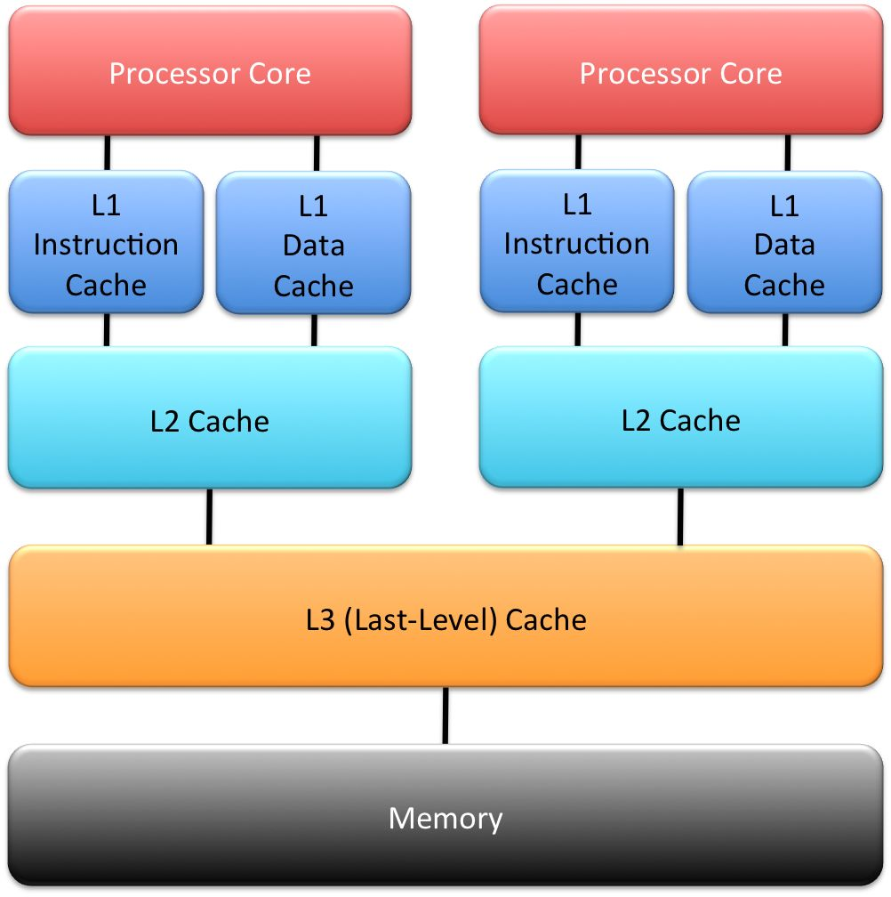

  
现代处理器为了弥补内存速度低下的缺陷，引入Cache来提高处理器访问程序和数据的速度，Cache作为连接内核和内存的桥梁，极大提升了程序的运行速度。为什么处理器内部加一个速度快，容量小的cache就能提速呢？这里基于程序的两个特性：时间的局部性(Temporal locality)和空间的局部性(Spatial)  
\`\`\`  
\[1\] 时间的局部性(Temporal locality)：如果某个数据被访问了，那么不久的将来它很有可能被再次访问到。典型的例子就是循环，循环的代码被处理器重复执行，将循环代码放在Cache中，那么只是在第一次的时候需要耗时较长去内存取，以后这些代码都能被内核从cache中快速访问到。  
\[2\] 空间的局部性(Spatial)：如果某个数据被访问了，那么它相临的数据很可能很快被访问到。典型的例子就是数组，数组中的元素常常安装顺序依次被程序访问。  
\`\`\`  
现代处理器一般是多个核心Core，每个Core在并发执行不同的代码和访问不同的数据，为了隔离影响，每个core都会有自己私有的cache(如图的L1和L2)，同时也在容量和存储速度上进行一个平衡(容量也大存储速度越慢，速度：L1>L2>L3， 容量：L3>L2>L1)，于是就出现图中的层次化管理。Cache的层次化必然带来一个cache一致性的问题：  

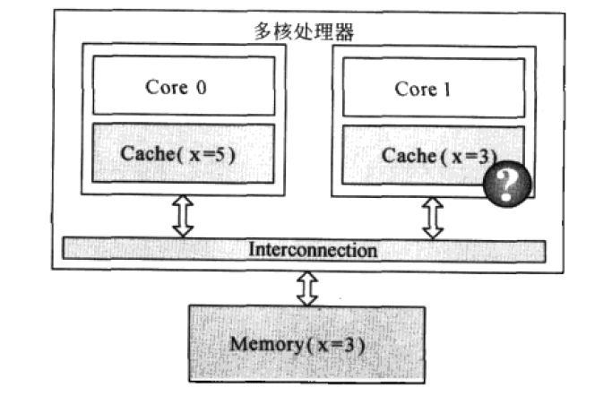

  

如图的例子，变量X(初始值是3)被cache在Core 0和Core 1的私有cache中，这时core 0将X修改成5，如果core 1不知道X已经被修改了，继续使用cache中的旧值，那么可能会导致严重的问题，这就是Cache的不一致导致的。为了保证Cache的一致性，处理器提供两个保证Cache一致性的底层操作：Write Invalidate和Write Update。  
\`\`\`  
Write Invalidate(置无效)：当一个CPU Core修改了一份数据X，那么它需要通知其他core将他们的cache中的X设置为无效(invalid)(如果cache中有的话)，如下图  
\`\`\`  

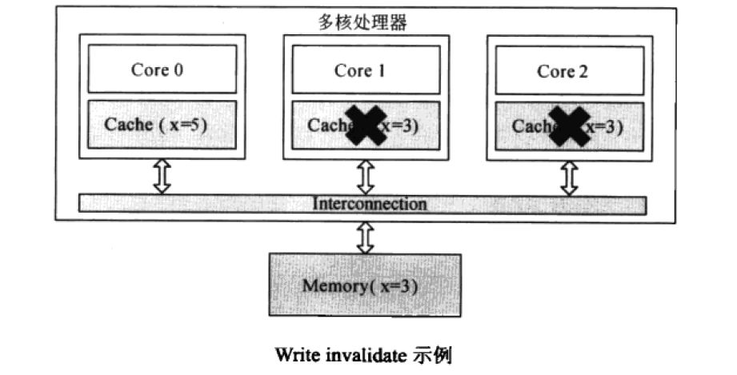

\`\`\`  
Write Update(写更新)：当一个CPU Core修改了一份数据X，那么它需要通知其他core将他们的cache中的X更新到最新值(如果cache中有的话)，如下图  
\`\`\`  

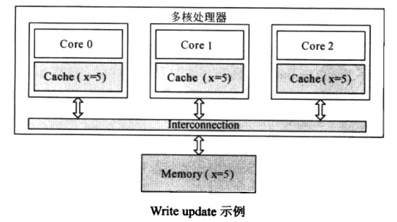

  
Write Invalidate和Write Update的比较：Write Invalidate是一种更为简单和轻量的实现方式，它不需要立刻将数据更新到存储中(这时一个耗时过程)，如果后续Core 0继续需要修改X而Core 1和Core 2又不再使用数据X了，那么这个Update过程就有点做了无用功，而采用write invalidate就更为轻量和有效。不过，由于valid标志是对应一个Cache line的，将valid标志设置为invalid后，这个cache line的其他本来有效的数据也不能被使用了，如果处理不好容易出现前面提到的False sharing(伪共享)和Cache pingpong问题。

  

**6.2.2 cache一致性协议MESI**  
由于Write Invalidate比较简单和轻量，大多数现代处理器都采用Write Invalidate策略，基于Write Invalidate处理器会有一套完整的协议来保证Cache的一致性，比较经典的当属MESI协议，奔腾处理器采用它，很多其他处理器都是采用它的一个小变种。

  
每个核的Cache中的每个Cache Line都有2个标志位：dirty标志和valid标志位，两个标志位分别描述了Cache和Memory间的数据关系(数据是否有效，数据是否被修改)，而在多核处理器中，多个核会共享一些数据，MESI协议就包含了描述共享的状态。

  
这样在MESI协议中，每个Cache line都有4个状态，可用2个bit来表示(也就是，每个cache line除了物理地址和具体的数据之外，还有一个2-bit的tag来标识该cacheline的4种不同的状态)：  
\`\`\`  
\[1\] M(Modified): cache line数据有效，但是数据被修改过了，本Cache中的数据是最新的，内存的数据是老的，需要在适当时候将Cache数据写回内存。因此，处于modified状态的cacheline也可以说是被该CPU独占。而又因为只有该CPU的cache保存了最新的数据（最终的memory中都没有更新），所以，该cache需要对该数据负责到底。例如根据请求，该cache将数据及其控制权传递到其他cache中，或者cache需要负责将数据写回到memory中，而这些操作都需要在reuse该cache line之前完成。  
  
\[2\] E(Exclusive)：cache line数据有效，并且cache和memory中的数据是一致的，同时数据只在本cache中有效。exclusive状态和modified状态非常类似，唯一的区别是对应CPU还没有修改cacheline中的数据，也正因为还没有修改数据，因此memory中对应的data也是最新的。在exclusive状态下，cpu也可以不通知其他CPU cache而直接对cacheline进行操作，因此，exclusive状态也可以被认为是被该CPU独占。由于memory中的数据和cacheline中的数据都是最新的，因此，cpu不需对exclusive状态的cacheline执行写回的操作或者将数据以及归属权转交其他cpu cache，而直接reuse该cacheline（将cacheine中的数据丢弃，用作他用）。  
  
\[3\] S(Shared)：cache line的数据有效，并且cache和memory中的数据是一致的，同时该数据在多个cpu cache中也是有效的。和exclusive状态类似，处于share状态的cacheline对应的memory中的数据也是最新的，因此，cpu也可以直接丢弃cacheline中的数据而不必将其转交给其他CPU cache或者写回到memory中。  
  
\[4\] I(Invalid)：本cache line的数据已经是无效的。处于invalid状态的cacheline是空的，没有数据。当新的数据要进入cache的时候，优选状态是invalid的cacheline，之所以如此是因为如果选中其他状态的cacheline，则说明需要替换cacheline数据，而未来如果再次访问这个被替换掉的cacheline数据的时候将遇到开销非常大的cache miss。  
\`\`\`  
在MESI协议中，每个CPU都会监听总线(bus)上的其他CPU对每个Cache line的所有操作，因此该协议也称为监听(snoop)协议，监听协议比较简单，被多少处理器使用，不过监听协议的沟通成本比较高。有另外一种协议叫目录协议，他采用集中管理的方式，将cache共享的信息集中在一起，类似一个目录，只有共享的Cache line才会交互数据，这种协议沟通成本就大大减少了。在基于snoop的处理器中，所有的CPU都是在一个共享的总线上，多个CPU之间需要相互通信以保证Cache line在M、E、S、I四个状态间正确的转换，从而保证数据的一致性。通常情况下，CPU需要以下几个通信message即可：  
\`\`\`  
\[1\] Read消息：read message用来获取指定物理地址上的cacheline数据。  
  
\[2\] Read Response消息：该消息携带了read message请求的数据。read response可能来自memory，也可能来自其他的cache。例如：如果一个cache有read message请求的数据并且该cacheline的状态是modified，那么该cache必须以read response回应这个read message，因为该cache中保存了最新的数据。  
  
\[3\] Invalidate消息：该命令用来将其他cpu cache中的数据设定为无效。该命令携带物理地址的参数，其他CPU cache在收到该命令后，必须进行匹配，发现自己的cacheline中有该物理地址的数据，那么就将其移除并用Invalidate Acknowledge回应。  
  
\[4\] Invalidate Acknowledge消息： 收到invalidate message的cpu cache，在移除了其cache line中的特定数据之后，必须发送invalidate acknowledge消息。  
  
\[5\] Read Invalidate消息： 该message中也包括了物理地址这个参数，以便说明其想要读取哪一个cacheline数据。此外，该message还同时有invalidate message的功效，即其他的cache在收到该命令后，移除自己cacheline中的数据。因此，Read Invalidate message实际上就是read ＋ invalidate。发送Read Invalidate之后，cache期望收到一个read response以及多个invalidate acknowledge。  
  
\[6\] Writeback消息： 该message包括两个参数，一个是地址，另外一个是写回的数据。该消息用在modified状态的cacheline被驱逐出境（给其他数据腾出地方）的时候发出，该命名用来将最新的数据写回到memory（或者其他的CPU cache中）。  
\`\`\`  
根据protocol message的发送和接收情况，cacheline会在“modified”, “exclusive”, “shared”, 和 “invalid”这四个状态之间迁移，具体如下图所示：  

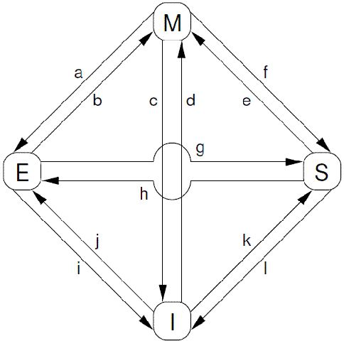

对上图中的状态迁移解释如下：  
\`\`\`  
\[a\] Transition (a)：cache可以通过writeback transaction将一个cacheline的数据写回到memory中（或者下一级cache中），这时候，该cacheline的状态从Modified迁移到Exclusive状态。对于cpu而言，cacheline中的数据仍然是最新的，而且是该cpu独占的，因此可以不通知其他cpu cache而直接修改之。  
  
\[b\] Transition (b)：在Exclusive状态下，cpu可以直接将数据写入cacheline，不需要其他操作。相应的，该cacheline状态从Exclusive状态迁移到Modified状态。这个状态迁移过程不涉及bus上的Transaction（即无需MESI Protocol Messages的交互）。  
  
\[c\] Transition (c)：CPU 在总线上收到一个read invalidate的请求，同时，该请求是针对一个处于modified状态的cacheline，在这种情况下，CPU必须该cacheline状态设置为无效，并且用read response”和“invalidate acknowledge来回应收到的read invalidate的请求，完成整个bus transaction。一旦完成这个transaction，数据被送往其他cpu cache中，本地的copy已经不存在了。  
  
\[d\] Transition (d)：CPU需要执行一个原子的readmodify-write操作，并且其cache中没有缓存数据，这时候，CPU就会在总线上发送一个read invalidate用来请求数据，同时想独自霸占对该数据的所有权。该CPU的cache可以通过read response获取数据并加载cacheline，同时，为了确保其独占的权利，必须收集所有其他cpu发来的invalidate acknowledge之后（其他cpu没有local copy），完成整个bus transaction。  
  
\[e\] Transition (e)：CPU需要执行一个原子的readmodify-write操作，并且其local cache中有read only的缓存数据（cacheline处于shared状态），这时候，CPU就会在总线上发送一个invalidate请求其他cpu清空自己的local copy，以便完成其独自霸占对该数据的所有权的梦想。同样的，该cpu必须收集所有其他cpu发来的invalidate acknowledge之后，才算完成整个bus transaction。  
  
\[f\] Transition (f)：在本cpu独自享受独占数据的时候，其他的cpu发起read请求，希望获取数据，这时候，本cpu必须以其local cacheline的数据回应，并以read response回应之前总线上的read请求。这时候，本cpu失去了独占权，该cacheline状态从Modified状态变成shared状态（有可能也会进行写回的动作）。  
  
\[g\] Transition (g)：这个迁移和f类似，只不过开始cacheline的状态是exclusive，cacheline和memory的数据都是最新的，不存在写回的问题。总线上的操作也是在收到read请求之后，以read response回应。  
  
\[h\] Transition (h)：如果cpu认为自己很快就会启动对处于shared状态的cacheline进行write操作，因此想提前先霸占上该数据。因此，该cpu会发送invalidate敦促其他cpu清空自己的local copy，当收到全部其他cpu的invalidate acknowledge之后，transaction完成，本cpu上对应的cacheline从shared状态切换exclusive状态。还有另外一种方法也可以完成这个状态切换：当所有其他的cpu对其local copy的cacheline进行写回操作，同时将cacheline中的数据设为无效（主要是为了为新的数据腾些地方），这时候，本cpu坐享其成，直接获得了对该数据的独占权。  
  
\[i\] Transition (i)：其他的CPU进行一个原子的read-modify-write操作，但是，数据在本cpu的cacheline中，因此，其他的那个CPU会发送read invalidate，请求对该数据以及独占权。本cpu回送read response”和“invalidate acknowledge”，一方面把数据转移到其他cpu的cache中，另外一方面，清空自己的cacheline。  
  
\[j\] Transition (j)：cpu想要进行write的操作但是数据不在local cache中，因此，该cpu首先发送了read invalidate启动了一次总线transaction。在收到read response回应拿到数据，并且收集所有其他cpu发来的invalidate acknowledge之后（确保其他cpu没有local copy），完成整个bus transaction。当write操作完成之后，该cacheline的状态会从Exclusive状态迁移到Modified状态。  
  
\[k\] Transition (k)：本CPU执行读操作，发现local cache没有数据，因此通过read发起一次bus transaction，来自其他的cpu local cache或者memory会通过read response回应，从而将该cacheline从Invalid状态迁移到shared状态。  
  
\[l\] Transition (l)：当cacheline处于shared状态的时候，说明在多个cpu的local cache中存在副本，因此，这些cacheline中的数据都是read only的，一旦其中一个cpu想要执行数据写入的动作，必须先通过invalidate获取该数据的独占权，而其他的CPU会以invalidate acknowledge回应，清空数据并将其cacheline从shared状态修改成invalid状态。  
\`\`\`  
下面通过几个例子，说明一下MESI协议是怎么工作的。CPU执行序列如下：  

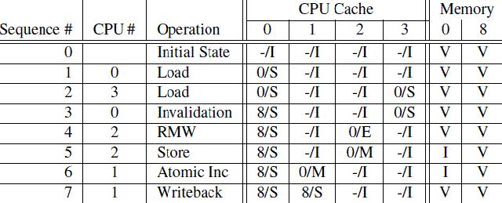

  

第一列是操作序列号，第二列是执行操作的CPU，第三列是具体执行哪一种操作，第四列描述了各个cpu local cache中的cacheline的状态（用meory address/状态表示），最后一列描述了内存在0地址和8地址的数据内容的状态：V表示是最新的，和cpu cache一致，I表示不是最新的内容，最新的内容保存在cpu cache中。  
\`\`\`  
\[1\] sequence 0：初始状态下，内存地址0和8保存了最新的数据，而4个CPU的cache line都是invalid(没cache任何数据或cache的数据都是过期无效的)。  
  
\[2\] sequence 1：CPU 0对内存地址0执行load操作，这样内存地址0的数据被加载到CPU 0的cache line中，CPU 0的cache line从Invalid状态切换到Share状态(这个时候，CPU 0的cache line和内存地址0都是相同的最新数据)。  
  
\[3\] sequence 2：CPU 3也对内存地址0执行load操作，这样内存地址0的数据被加载到CPU 3的cache line中，CPU 3的cache line从Invalid状态切换到Share状态(这个时候，CPU 0、CPU 3的cache line和内存地址0都是相同的最新数据)。  
  
\[4\] sequence 3：CPU 0执行对内存地址8的load操作，(内存地址0和8共用一个cache line set)由于cache line已经存放了内存地址0的数据，这个时候，CPU 0需要将cache line的数据清理掉(Invalidation)以便腾出空间存放内存地址8的数据。由于，当前cache line的状态是Share，CPU 0不需要通知其他CPU，CPU 0在Invalidation cache line的数据后，就加载内存地址8的数据到cache line中，并将cache line状态改成Share。  
  
\[5\] sequence 4：CPU 2对内存地址0执行load操作，由于CPU 2知道程序随后会修改该值，它需要独占该数据，因此CPU 2向总线发送了read invalidate命令，一方面获取该数据(自己的local cache中没有地址0的数据)，另外，CPU 2想独占该数据（因为随后要write）。这个操作导致CPU 3的cacheline迁移到invalid状态。当然，这时候，memory仍然是最新的有效数据。  
  
\[6\] sequence 5：CPU 2对内存地址0执行Store操作，由于CPU 2的cache line是Exclusive状态(对内存地址0的数据是独占状态的)，于是CPU 2可以直接将新的值写入cache line覆盖老值，cache line状态转换成Modified状态。(这个时候，内存地址0中的数据已经是Invalid的，其他CPU如果想load内存地址0的数据，不能直接从内存地址0加载数据了，需要嗅探(snoop)的方式从CPU 2的local cache中获取。  
  
\[7\] sequence 6：CPU 1对内存地址0执行一个原子加操作。这时候CPU 1会发出read invalidate命令，将地址0的数据从CPU 2的cache line中嗅探得到，同时通过invalidate其他CPU local cache的内容而获得独占性的数据访问权。这时候，CPU 2中的cache line状态变成invalid状态，而CPU 1的cache line将从invalid状态迁移到modified状态。  
  
\[8\] sequence 7：CPU 1对内存地址8执行load操作。由于cache line已经存放了内存地址0的数据，并且该状态是modified的，CPU 1需要将cache line的数据写回地址0，于是执行write back操作将地址0的数据写回到memory(这个时候，内存地址0中的数据从Invalid变成有效的)。接着，CPU 1发出read命令，从CPU 0中得到内存地址8的数据，并写入自己的cache line，cache line状态转换成Share。  
\`\`\`  
通过上面的例子，我们发现，对于某些特定地址的数据（在一个cache line中）重复的进行读写，这种结构可以获得很好的性能(例如，在sequence 5，CPU 2反复对内存地址0进行store操作将获得很好的性能，因为，每次store操作，CPU 2仅仅需要将新值写入自己的local cache即可)，不过，对于第一次写，其性能非常差，如图：  

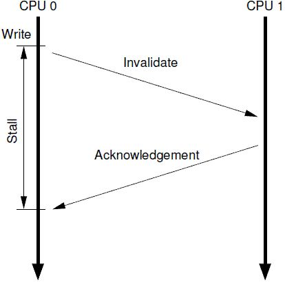

  

cpu 0发起一次对某个地址的写操作，但是local cache没有数据，该数据在CPU 1的local cache中，因此，为了完成写操作，CPU 0发出invalidate的命令，invalidate其他CPU的cache数据。只有完成了这些总线上的transaction之后，CPU 0才能正在发起写的操作，这是一个漫长的等待过程。

  

**6.2.3 Store Buffer**  
对于CPU 0来说，这样的漫长等待显得有点没必要，因为，CPU 1中的cache line保存有什么样子的数据，其实都没有意义，这个值都会被CPU 0新写入的值覆盖的。为了给CPU 0提速，需要将这种同步阻塞等待，变成异步处理。于是，硬件工程师，修改CPU架构，在CPU和cache之间增加store buffer这个HW block，如下图所示：  

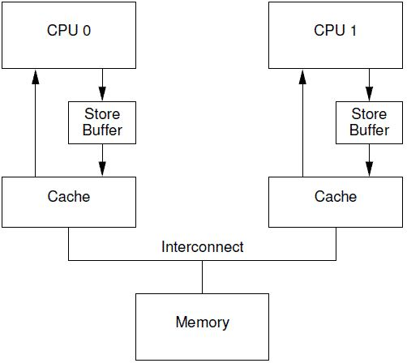

  

一旦增加了store buffer，那么cpu 0无需等待其他CPU的相应，只需要将要修改的内容放入store buffer，然后继续执行就OK了。当cache line完成了bus transaction，并更新了cache line的状态后，要修改的数据将从store buffer进入cache line。引入了store buff，带来了一些复杂性，一不小心，会带来本地数据不一致的问题。我们先看看下面的代码：  
\`\`\`  
1 a = 1;   
2 b = a + 1;   
3 assert(b == 2);  
a和b都是初始化为0，并且变量a在CPU 1的cache line中，变量b在CPU 0的cacheline中。  
\`\`\`  
如果cpu执行上述代码，那么第三行的assert不应该失败，不过，如果CPU设计者使用上图中的那个非常简单的store buffer结构，那么你应该会遇到“惊喜”（assert失败了）。具体的执行序列过程如下：  
\`\`\`  
\[1\] CPU 0执行a=1的赋值操作, CPU 0遇到cache miss  
\[2\] CPU 0发送read invalidate消息以便从CPU 1那里获得数据，并invalid其他cpu保存a数据的local cache line。  
\[3\] 由于store buff的存在，CPU 0把要写入的数据“1”放入store buffer  
\[4\] CPU 1收到read invalidate后回应，把本地cache line的数据发送给CPU 0并清空本地cache中a的数据。  
\[5\] CPU 0执行b = a + 1  
\[6\] CPU 0 收到来自CPU 1的数据，该数据是“0”  
\[7\] CPU 0从cache line中加载a，获得0值  
\[8\] CPU 0将store buffer中的值写入cache line，这时候cache中的a值是“1”  
\[9\] CPU 0执行a＋1，得到1并将该值写入b  
\[10\] CPU 0 executes assert(b == 2), which fails. OMG，你期望b等于2，但是实际上b等于了1  
\`\`\`  
导致这个问题的根本原因是我们有两个a值，一个在cache line中，一个在store buffer中。store buffer的引入，违反了每个CPU按照其视角来观察自己的行为的时候必须是符合program order的原则。一旦违背这个原则，对软件工程师而言就是灾难。还好，有”好心“的硬件工程师帮助我们，修改了CPU的设计如下：  

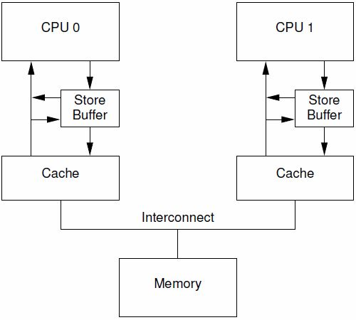

  
这种设计叫做store forwarding，当CPU执行load操作的时候，不但要看cache，还有看store buffer是否有内容，如果store buffer有该数据，那么就采用store buffer中的值。有了store forwarding的设计，上面的步骤\[7\]中就可以在store buffer获取正确的a值是”1“而不是”0“，因此计算得到的b的结果就是2，和我们预期的一致了。

  
store forwarding解决了CPU 0的cache line和store buffer间的数据一致性问题，但是，在CPU 1的角度来看，是否也能看到一致的数据呢？我们来看下一个例子：  
\`\`\`  
1 void foo(void)   
2 {   
3     a = 1;   
4     b = 1;   
5 }   
6   
7 void bar(void)   
8 {   
9    while (b == 0) continue;   
10  assert(a == 1);   
11 }  
同样的，a和b都是初始化成0.  
\`\`\`  
我们假设CPU 0执行foo函数，CPU 1执行bar函数，a变量在CPU 1的cache中，b在CPU 0 cache中，执行的操作序列如下：  
\`\`\`  
\[1\] CPU 0执行a=1的赋值操作，由于a不在local cache中，因此，CPU 0将a值放到store buffer中之后，发送了read invalidate命令到总线上去。

\[2\] CPU 1执行 while (b == 0) 循环，由于b不在CPU 1的cache中，因此，CPU发送一个read message到总线上，看看是否可以从其他cpu的local cache中或者memory中获取数据。  
\[3\] CPU 0继续执行b=1的赋值语句，由于b就在自己的local cache中（cacheline处于modified状态或者exclusive状态），因此CPU0可以直接操作将新的值1写入cache line。  
\[4\] CPU 0收到了read message，将最新的b值”1“回送给CPU 1，同时将b cacheline的状态设定为shared  
\[5\] CPU 1收到了来自CPU 0的read response消息，将b变量的最新值”1“值写入自己的cacheline，状态修改为shared。  
\[6\] 由于b值等于1了，因此CPU 1跳出while (b == 0)的循环，继续前行。  
\[7\] CPU 1执行assert(a == 1)，这时候CPU 1的local cache中还是旧的a值，因此assert(a == 1)失败。  
\[8\] CPU 1收到了来自CPU 0的read invalidate消息，以a变量的值进行回应，同时清空自己的cacheline，但是这已经太晚了。  
\[9\] CPU 0收到了read response和invalidate ack的消息之后，将store buffer中的a的最新值”1“数据写入cacheline，然并卵，CPU 1已经assertion fail了。  
\`\`\`  
CPU 1出现异常的assertion fail的根本原因是，CPU 0在发出read invalidate message后，并没有等待CPU 1收到，就继续执行将b改写为1，也就是store buffer的存在导致了CPU 1先看到了b修改为1，后看到a被修改为1。遇到这样的问题，CPU设计者也不能直接帮什么忙(除非去掉store buffer)，毕竟CPU并不知道哪些变量有相关性，这些变量是如何相关的。不过CPU设计者可以间接提供一些工具让软件工程师来控制这些相关性。这些工具就是memory-barrier指令。要想程序正常运行，必须增加一些memory barrier的操作，具体如下：  
\`\`\`  
1 void foo(void)   
2 {   
3     a = 1;   
4     smp\_mb();   
5     b = 1;   
6 }   
7   
8 void bar(void)   
9 {   
10     while (b == 0) continue;   
11     assert(a == 1);   
12}  
\`\`\`  
smp\_mb() 这个内存屏障的操作会在执行后续的store操作之前，首先flush store buffer（也就是将之前的值写入到cacheline中）。达到这个目标有两种方法：  
\`\`\`  
\[1\] CPU遇到smp\_mb内存屏障后，需要等待store buffer中的数据完成transaction并将strore buffer中的数据写入cache line；  
\[2\] CPU在遇到smp\_mb内存屏障后，可以继续前行，但是需要记录一下store buffer中的数据顺序，在store buffer中的数据严格按顺序全部写回cache line之前，其他数据不能先更新cache line，需要按照顺序先写到store buffer才能继续前行。  
\`\`\`  
通常采用的是方法\[2\]，增加了smp\_mb()后，执行序列如下：  
\`\`\`  
\[1\] CPU 0执行a=1的赋值操作，由于a不在local cache中，因此，CPU 0将a值放到store buffer中之后，发送了read invalidate命令到总线上去。  
\[2\] CPU 1执行 while (b == 0) 循环，由于b不在CPU 1的cache中，因此，CPU发送一个read message到总线上，看看是否可以从其他cpu的local cache中或者memory中获取数据。  
\[3\] CPU 0执行smp\_mb()函数，给目前store buffer中的所有项做一个标记（后面我们称之marked entries）。当然，针对我们这个例子，store buffer中只有一个marked entry就是“a=1”。  
\[4\] CPU 0继续执行b=1的赋值语句，虽然b就在自己的local cache中（cacheline处于modified状态或者exclusive状态），不过在store buffer中有marked entry，因此CPU 0不能直接操作将新的值1写入cache line，取而代之是b的新值'1'被写入store buffer(CPU 0也可以不执行b=1语句，等到a的transaction完成并写回cache line，在执行b=1，将b的新值'1'写入cache line)，当然是unmarked状态。  
\[5\] CPU 0收到了read message，将b值”0“（新值”1“还在store buffer中）回送给CPU 1，同时将b cacheline的状态设定为shared。  
\[6\] CPU 1收到了来自CPU 0的read response消息，将b变量的值（'0'）写入自己的cacheline，状态修改为shared。  
\[7\] 由于smp\_mb内存屏障的存在，b的新值'1'隐藏在CPU 0的store buffer中，CPU 1只能看到b的旧值'0'，这时CPU 1处于死循环中。  
\[8\] CPU 1收到了来自CPU 0的read invalidate消息，以a变量的值进行回应，同时清空自己的cacheline。  
\[9\] CPU 0收到CPU 1的响应msg，完成了a的赋值transaction，CPU 0将store buffer中的a值写入cacheline，并且将cacheline状态修改为modified状态。  
\[10\] 由于store buffer只有一项marked entry（对应a=1），因此，完成step 9之后，store buffer的b也可以进入cacheline了。不过需要注意的是，当前b对应的cache line的状态是shared。  
\[11\] CPU 0想将store buffer中的b的新值'1'写回cache line。由于b的cache line是share的。CPU 0需要发送invalidate消息，请求b数据的独占权。  
\[12\] CPU 1收到invalidate消息，清空自己b的 cache line，并回送acknowledgement给CPU 0。  
\[13\] CPU 1的某次循环执行到while (b == 0)，这时发现b的cache line是Invalid的了，于是CPU 1发送read消息，请求获取b的数据。  
\[14\] CPU 0收到acknowledgement消息，将b对应的cache line修改成exclusive状态，这时候，CPU 0终于可以将b的新值1写入cache line了。  
\[15\] CPU 0收到read消息，将b的新值1回送给CPU 1，同时将其local cache中b对应的cacheline状态修改为shared。  
\[16\]  CPU 1获取来自CPU 0的b的新值，将其放入cache line中。  
\[17\] 由于b值等于1了，因此CPU 1跳出while (b == 0)的循环，继续前行。  
\[18\] CPU 1执行assert(a == 1)，不过这时候a值没有在自己的cache line中，因此需要通过cache一致性协议从CPU 0那里获得，这时候获取的是a的最新值，也就是1值，因此assert成功。  
\`\`\`  
从上面的执行序列可以看出，在调用memory barrier指令之后，使得CPU 0迟迟不能将b的新值'1'写回cache line，从而使得CPU 1一直不能观察到b的新值'1'，造成CPU 1一直不能继续前行。直观上CPU 0似乎不受什么影响，因为CPU 0可以继续前行，只是将b的新值'1'写到store buffer而不能写回cache line。不幸的是：每个cpu的store buffer不能实现的太大，其entry的数目不会太多。当cpu 0以中等的频率执行store操作的时候（假设所有的store操作导致了cache miss），store buffer会很快的被填满。在这种状况下，CPU 0只能又进入等待状态，直到cache line完成invalidation和ack的交互之后，可以将store buffer的entry写入cacheline，从而为新的store让出空间之后，CPU 0才可以继续执行。这种状况恰恰在调用了memory barrier指令之后，更容易发生，因为一旦store buffer中的某个entry被标记了，那么随后的store都必须等待invalidation完成，因此不管是否cache miss，这些store都必须进入store buffer，这样就很容易塞满store buffer。

  

**6.2.4 Invalidate Queue**  
store buffer之所以很容易被填充满，主要是其他CPU回应invalidate acknowledge比较慢，如果能够加快这个过程，让store buffer尽快进入cache line，那么也就不会那么容易填满了。

  
invalidate acknowledge不能尽快回复的主要原因是invalidate cacheline的操作没有那么快完成，特别是cache比较繁忙的时候，这时，CPU往往进行密集的loading和storing的操作，而来自其他CPU的，对本CPU local cacheline的操作需要和本CPU的密集的cache操作进行竞争，只要完成了invalidate操作之后，本CPU才会发生invalidate acknowledge。此外，如果短时间内收到大量的invalidate消息，CPU有可能跟不上处理，从而导致其他CPU不断的等待。

  
要想达到快速回复acknowledgement，一个解决方法是，引入一个缓冲队列，接收到invalidate请求，可以先将请求入队缓冲队列，就可以回复acknowledgement消息了，后面在异步完成invalidate操作。于是硬件工程师，引入一个invalidate  queue，有invalidate queue的系统结构如下图所示：  

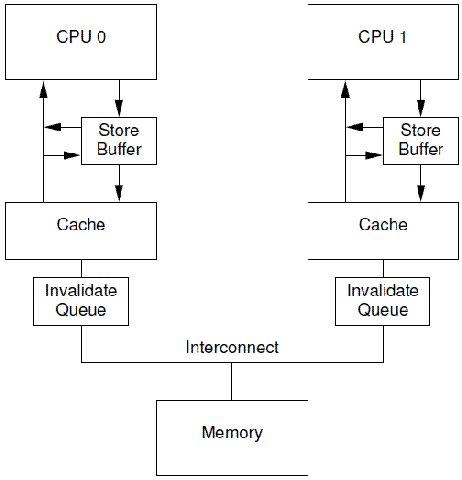

  

异步延后处理，也需要有个度才行。一旦将一个invalidate（例如针对变量a的cacheline）消息放入CPU的Invalidate Queue，实际上该CPU就等于作出这样的承诺：在处理完该invalidate消息之前，不会发送任何相关（即针对变量a的cacheline）的MESI协议消息。为什么是在发出某个变量a的MESI协议消息的时候，需求去检查invalidate queue看是否有变量a的invalidate消息呢？而不是在对该变量的任何操作都需要检查以下invalidate queue呢？其实这样在保证MESI协议正确性的情况下，进一步保证性能的折中方案。

  
因为，在单纯考虑性能的情况下，少去检查invalidate queue，周期性(一定时间，cpu没那么繁忙、invalidate queue容量达到一定)批量处理invalidate queue中的消息，这样性能能够达到最佳。但是，这样在某些情况下，使得MESI协议失效。例如：在一个4核的机器上，变量a初始值是'0'，它cache在CPU 0和CPU 1的cache line中，状态都是Share。  
\`\`\`  
\[1\] CPU 0需要修改变量a的值为'1'，CPU 0发送invalidate消息给其他CPU(1~3).  
\[2\] 其他CPU(1~3)将invalidate消息放入invalidate queue，然后都回复给CPU 0.  
\[3\] CPU 0收到响应后，将a的新值'1'写入cache line并修改状态为Modified。  
\[4\] CPU 2需要读取a的时候遇到cache miss，于是CPU 2发送read消息给其他CPU，请求获取a的数据。  
\[5\] CPU 1收到read请求，由于a在自己的cache line并且是share状态的，于是CPU 1将a的invalid值'0'响应给CPU 2。  
\[6\] CPU 2通过一个read消息获取到一个过期的非法的值，这样MESI协议无法保证数据一致性了。  
\`\`\`  
于是，为了保证MESI协议的正确性，CPU在需要发出某个变量的a的MESI协议消息的时候，需要检查invalidate queue中是否有该变量a的invalidate消息，如果有需要先出来完成这个invliadte消息后，才能发出正确的MESI协议消息。在合适的时候，发出正确的MESI协议是保证了不向其他CPU传递错误的信息，从而保证数据的一致性。但是，对于本CPU是否也可以高枕无忧呢？我们来看同上面一样的一个例子：  
\`\`\`  
1 void foo(void)   
2 {   
3     a = 1;   
4     smp\_mb();   
5     b = 1;   
6 }   
7   
8 void bar(void)   
9 {   
10     while (b == 0) continue;   
11     assert(a == 1);   
12 }  
\`\`\`  
在上面的代码片段中，我们假设a和b初值是0，并且a在CPU 0和CPU 1都有缓存的副本，即a变量对应的CPU0和CPU 1的cacheline都是shared状态。b处于exclusive或者modified状态，被CPU 0独占。我们假设CPU 0执行foo函数，CPU 1执行bar函数，执行序列如下：  
\`\`\`  
\[1\] CPU 0执行a=1的赋值操作，由于a在CPU 0 local cache中的cacheline处于shared状态，因此，CPU 0将a的新值“1”放入store buffer，并且发送了invalidate消息去清空CPU 1对应的cacheline。  
\[2\] CPU 1执行while (b == 0)的循环操作，但是b没有在local cache，因此发送read消息试图获取该值。  
\[3\] CPU 1收到了CPU 0的invalidate消息，放入Invalidate Queue，并立刻回送Ack。  
\[4\] CPU 0收到了CPU 1的invalidate ACK之后，即可以越过程序设定内存屏障（第四行代码的smp\_mb() ），这样a的新值从store buffer进入cacheline，状态变成Modified。  
\[5\]  CPU 0 越过memory barrier后继续执行b=1的赋值操作，由于b值在CPU 0的local cache中，因此store操作完成并进入cache line。  
\[6\] CPU 0收到了read消息后将b的最新值“1”回送给CPU 1，并修正该cache line为shared状态。  
\[7\] CPU 1收到read response，将b的最新值“1”加载到local cacheline。  
\[8\] 对于CPU 1而言，b已经等于1了，因此跳出while (b == 0)的循环，继续执行后续代码  
\[9\] CPU 1执行assert(a == 1)，但是由于这时候CPU 1 cache的a值仍然是旧值0，因此assertion 失败  
\[10\] 该来总会来，Invalidate Queue中针对a cacheline的invalidate消息最终会被CPU 1执行，将a设定为无效，但，大错已经酿成。  
\`\`\`  
CPU 1出现assert失败，是因为没有及时处理invalidate queue中的a的invalidate消息，导致使用了本cache line中的一个已经是invalid的一个旧的值，这是典型的cache带来的一致性问题。这个时候，我们也需要一个memory barrier指令来告诉CPU，这个时候应该需要处理invalidate queue中的消息了，否则可能会读到一个invalid的旧值。  
\`\`\`  
当CPU执行memory barrier指令的时候，对当前Invalidate Queue中的所有的entry进行标注，这些被标注的项被称为marked entries，而随后CPU执行的任何的load操作都需要等到Invalidate Queue中所有marked entries完成对cacheline的操作之后才能进行  
\`\`\`  
因此，要想保证程序逻辑正确，我们需要给bar函数增加内存屏障的操作，具体如下：  
\`\`\`  
1 void foo(void)   
2 {   
3     a = 1;   
4     smp\_mb();   
5     b = 1;   
6 }   
7   
8 void bar(void)   
9 {   
10    while (b == 0) continue;   
11     smp\_mb();   
12     assert(a == 1);   
13 }  
\`\`\`  
bar()函数添加smp\_mb内存屏障后，执行序列如下：  
\`\`\`  
\[1\] ~ \[8\] 同上  
\[9\] CPU 1遇到smp\_mb内存屏障，发现下一条语句是load a，这个时候CPU 1不能继续执行代码，只能等待，直到Invalidate Queue中的message被处理完成  
\[10\] CPU 1处理Invalidate Queue中缓存的Invalidate消息，将a对应的cacheline设置为无效。  
\[11\] 由于a变量在local cache中无效，因此CPU 1在执行assert(a == 1)的时候需要发送一个read消息去获取a值。  
\[12\] CPU 0用a的新值1回应来自CPU 1的请求。  
\[13\] CPU 1获得了a的新值，并放入cacheline，这时候assert(a == 1)不会失败了。  
\`\`\`  
在我们上面的例子中，memory barrier指令对store buffer和invalidate queue都进行了标注，不过，在实际的代码片段中，foo函数不需要mark invalidate queue，bar函数不需要mark store buffer。因此，许多CPU architecture提供了弱一点的memory barrier指令只mark其中之一。如果只mark invalidate queue，那么这种memory barrier被称为read memory barrier。相应的，write memory barrier只mark store buffer。一个全功能的memory barrier会同时mark store buffer和invalidate queue。

  
我们一起来看看读写内存屏障的执行效果：对于read memory barrier指令，它只是约束执行CPU上的load操作的顺序，具体的效果就是CPU一定是完成read memory barrier之前的load操作之后，才开始执行read memory barrier之后的load操作。read memory barrier指令象一道栅栏，严格区分了之前和之后的load操作。同样的，write memory barrier指令，它只是约束执行CPU上的store操作的顺序，具体的效果就是CPU一定是完成write memory barrier之前的store操作之后，才开始执行write memory barrier之后的store操作。全功能的memory barrier会同时约束load和store操作，当然只是对执行memory barrier的CPU有效。

  
现在，我们可以改一个用读写内存屏障的版本了，具体如下：  
\`\`\`  
1 void foo(void)   
2 {   
3     a = 1;   
4     smp\_wmb();   
5     b = 1;   
6 }   
7   
8 void bar(void)   
9 {   
10    while (b == 0) continue;   
11     smp\_rmb();   
12     assert(a == 1);   
13 }  
\`\`\`  
可见，memory barrier需要成对使用才能保证程序的正确性。什么情况下使用memory barrier，使用怎样的memory barrier，和CPU架构有那些相关性呢？

  

**6.3 How Memory Barriers？**

memory barrier的语义在不同CPU上是不同的，因此，想要实现一个可移植的memory barrier的代码需要对形形色色的CPU上的memory barrier进行总结。幸运的是，无论哪一种cpu都遵守下面的规则：  
\`\`\`  
\[1\]、从CPU自己的视角看，它自己的memory order是服从program order的  
\[2\]、从包含所有cpu的sharebility domain的角度看，所有cpu对一个共享变量的访问应该服从若干个全局存储顺序  
\[3\]、memory barrier需要成对使用  
\[4\]、memory barrier的操作是构建互斥锁原语的基石  
\`\`\`  
**6.3.1 有条件的顺序保证**  
要保证程序在多核CPU中执行服从program order，那么我们需要成对使用的memory barrier，然而成对的memory barrier并不能提供绝对的顺序保证，只能提供有条件的顺序保证。那么什么是有条件的顺序保证？考虑下面一个访问例子(这里的access可以是读或写)：  

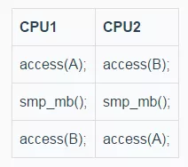

从CPU1角度来看，对A的访问总是先于对B的访问。但是，关键的是从CPU2的角度来看，CPU1对A、B的访问顺序是否就一定是A优先于B呢？假如在CPU2感知CPU1对A的访问结果的情况下，是否可以保证CPU2也能感知CPU1对B的访问结果呢？这是不一定的，例如执行时序如下，那么显然，在CPU2感知CPU1对A的访问结果的情况下，是并不能感知CPU1对B的访问结果(CPU2对A的访问要早于CPU1对B的访问)。  

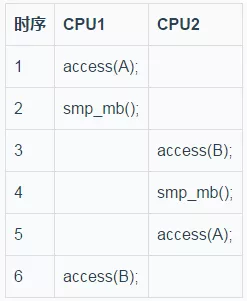

  

另外，如果CPU1对B的访问结果已经被CPU2感知到了，那么，在这个条件下，CPU1对A的访问结果就一定能够被CPU2感知到。这就是观察者(CPU2)在满足一定条件下才能保证这个memory的访问顺序。  
  
对于上面例子中的access操作，在内存上包括load和store两种不同操作，下面列出了CPU1和CPU2不同的操作组合共16个，下面来详细描述一下，在不同的操作组合下memory barrier可以做出怎样的保证。  

  

由于CPU架构千差万别，上面的16种组合可以分成3类  
\`\`\`  
\[1\] Portable Combinations -- 通杀所有CPU  
\[2\] Semi-Portable Combinations -- 现代CPU可以work，但是不适应在比较旧的那些CPU  
\[3\] Dubious Combinations -- 基本是不可移植的  
\`\`\`

**6.3.1.1 通杀所有CPU**  
(1) Pairing 1  
情况3，CPU执行代码如下：（A和B的初值都是0）  
  
| CPU1 | CPU2 |  
| ------ | ------ |  
| X = A; | B = 1; |   
| smp\_mb(); | smp\_mb(); |  
| Y = B; | A = 1; |  
  

对于这种情况，两个CPU都执行完上面的代码后，如果X的值是1，那么我们可以断定Y也是等于1的。也就是如果CPU1感知到了CPU2对A的访问结果，那么可以断定CPU1也必能感知CPU2对B的访问结果。但是，如果X的值是0，那么memory barrier的条件不存在，于是Y的值可能是0也可能是1。  
对于情况C，它是和情况1是对称，于是结论也是类似的：（A和B的初值都是0）  

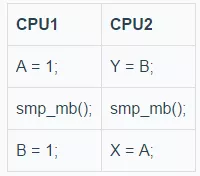

同样，两个CPU都执行完上面的代码后，如果Y的值是1，那么可以断定X的值也是1。  
(2) Pairing 2  
情况5，CPU执行代码如下：（A和B的初值都是0）  

两个CPU都执行完上面的代码后，在不影响逻辑的情况下，在CPU2的A=1;前面插入代码Z=X，根据情况C，如果Y的值是1，那么Z的值就一定是A，由于Z=X执行在A=1前面，那么Z的值是A的初始值0，于是X的值一定是0。同样，如果X等于1，那么我们一定可以得到Y等于0;  
(3) Pairing 3  
情况7，CPU执行代码如下：（A和B的初值都是0）  

两个CPU都执行完上面的代码后，在不影响逻辑的情况下，在CPU1的B=1;前面插入代码Z=B，根据情况3，如果X等于1，那么可以断定Z等于2，也就是在CPU1执行完毕Z=B代码前，B的值是2，由于CPU1在执行完Z=B后会执行B=1，于是对CPU1而已，最后B的值是1。  
通过上面(1) ，如果CPU1执行的全是store操作，而CPU2执行的全是load操作(对称下，CPU2执行的全是store操作，而CPU1执行的全是load操作)，那么会有一个memory barrier条件使得执行得到一个确定的顺序，并且是通吃所有CPU的。而，(2)和(3)经过插入代码也可以转换成(1)的情况。  
情况D，CPU执行代码如下：（A和B的初值都是0）  

该情况是情况7是类似的。在Y等1的时候，最终A等于2.  
  
**6.3.1.2 现代CPU可以work，但是不适应在比较旧的那些CPU**  
(1) Ears to Mouths  
情况A，CPU执行代码如下：（A和B初值都是0，其他变量初始值是-1）  

这种情况下，比较容易推算出X等1的时候，Y可能为0也可能为1，当X等于0的时候，也比较容易推算出Y值可以为1。但是，X等0的时候，Y有没可能也是0呢？

  
我们通过插入代码(Z=X)，这样就转换成情况C，在X等于0，Z等于0的时候，那么memory barrier条件成立，于是Y必然等1。然而，如果X等于0的时候，Z不等于0，这个时候memory barrier条件就不能成立了，这个时候Y就可能为0。

  
下面我们来讲下，上面情况下会出现X和Y同时为0。在一个有Invalidate queue和store buffer的系统中，B和X在CPU1的local cache中并且是独占的，A和Y在CPU2的local cache中并且也是独占的。CPUs的执行序列如下：  
\`\`\`  
\[1\] CPU1对A发起store操作，由于A不在CPU1的cache中，CPU1发起invalidate message，当然，CPU1不会停下它的脚步，将A的新值'1'放入store buffer，它就继续往下执行  
\[2\] smp\_mb使得CPU1对store buffer中的entry进行标注（当然也对Invalidate Queue进行标注，不过和本场景无关），store A的操作变成marked状态   
\[3\] CPU2对B发起store操作，由于B不在CPU2的cache中，CPU2发起invalidate message，当然，CPU2不会停下它的脚步，将B的新值'1'放入store buffer，它就继续往下执行  
\[4\] CPU2收到CPU1的invalidate message将该message放入Invalidate Queue后继续前行。  
\[5\] smp\_mb使得CPU2对store buffer中的entry进行标注（当然也对Invalidate Queue进行标注），store B的操作变成marked状态  
\[6\] CPU1收到CPU2的invalidate message将该message放入Invalidate Queue后继续前行。  
\[7\] CPU1前行执行load B，由于B在CPU1的local cache独占的(CPU1并不需要发送任何MESI协议消息，它并不需要立即处理Invalidate Queue里面的消息)，于是CPU1从local cache中得到B的值'0'，接着CPU1继续执行store X，由于X也在CPU1的local cache独占的，于是，CPU1将X的新值修改为B的值'0'并将其放入store buffer中。  
\[8\] CPU2前行执行load A，由于A在CPU2的local cache独占的(CPU2并不需要发送任何MESI协议消息，它并不需要立即处理Invalidate Queue里面的消息)，于是CPU2从local cache中得到A的值'0'，接着CPU2继续执行store Y，由于Y也在CPU2的local cache独占的，于是，CPU2将Y的新值修改为B的值'0'并将其放入store buffer中。  
\[9\] CPU1开始处理Invalidate Queue里面的消息，将本local cache中的B置为Invalide，同时响应Invalidate response message给CPU2  
\[10\] CPU2收到Invalidate response message后，这个时候可以将store buffer里面的B和Y写回cache line，最后B为1，Y为0。  
\[11\] CPU1和CPU2类似，最终A为1，X为0.  
\`\`\`  
(2) Pass in the Night  
情况F，CPU执行代码如下：（A和B初值都是0，其他变量初始值是-1）  
  
| CPU1 | CPU2 |  
| ------ | ------ |  
| A = 1; | B = 2;|   
| smp\_mb(); | smp\_mb(); |  
| B = 1; | A = 2; |  
  

情况F，正常情况下，无论如何，但是无论如何，在两个CPU都执行完上面的代码之后{A==1,B==2} 这种情况不可能发生。不幸的是，在一些老的CPU架构上，是可能出现{A==1,B==2} 的，出现这种情况和上面的原因有点类似，下面也简单描述一下，在一个有Invalidate queue和store buffer的系统中，B在CPU1的local cache中并且是独占的，A在CPU2的local cache中并且也是独占的。CPUs的执行序列如下：  
\`\`\`  
\[1\]~\[6\]和 (1) Ears to Mouths中的基本一样  
\[7\] CPU1继续前行，由于B在CPU1的local cache独占的(CPU1并不需要发送任何MESI协议消息，它并不需要立即处理Invalidate Queue里面的消息)，于是，CPU1将B的新值'1'放入store buffer中。  
\[8\] CPU2继续前行，由于A在CPU2的local cache独占的(CPU1并不需要发送任何MESI协议消息，它并不需要立即处理Invalidate Queue里面的消息)，于是，CPU2将A的新值'2'放入store buffer中。  
\[9\] CPU1开始处理Invalidate Queue里面的消息，将本local cache中的B置为Invalide(这个时候store buffer里面B的新值'1'也被invalidate了)，同时响应Invalidate response message给CPU2  
\[9\] CPU2开始处理Invalidate Queue里面的消息，将本local cache中的置为Invalide(这个时候store buffer里面A的新值'2'也被invalidate了)，同时响应Invalidate response message给CPU1  
\[10\] CPU1收到Invalidate response message，这个时候可以将store buffer中的A=1刷到cache line，最终A的值为1  
\[11\] CPU2收到Invalidate response message，这个时候可以将store buffer中的B=2刷到cache line，最终B的值为2  
\`\`\`  
到这来，大家应该会发现，第一个赋值（对于CPU1而言是A = 1，对于CPU2而言是B = 2）其实是pass in the night，静悄悄的走过，而第二个赋值（对于CPU1而言是B = 1，对于CPU2而言是A = 2）则会后发先至，最终导致第一个赋值先发而后至覆盖第二个赋值。  
其实，只要符合下面的使用模式，上面描述的操作顺序（第二个store的结果被第一个store覆盖）都是有可能发生的：  
  
| CPU1 | CPU2 |  
| ------ | ------ |  
| A = 1; | B = 2;|   
| smp\_mb(); | smp\_mb(); |  
|xxxx; | xxxx; |  
前面说的'ears to mouths'也是这种模式，不过，对于21世纪的硬件系统而言，硬件工程师已经帮忙解决了上面的问题，因此，软件工程师可以安全的使用Stores “Pass in the Night”。  
  
**6.3.1.3 基本不可移植**  
剩下的情况0、1、2、4、6、8、9这7种情况的组合，即使是在21世纪的那些新的CPU硬件平台上，也是不能够保证是可移植的。当然，在一些硬件平台上，我们还是可以得到一些确定的执行顺序的。  
(1) Ears to Ears  
情况0，CPUs上全是load操作  
  
| CPU1 | CPU2 |  
| ------ | ------ |  
| load A; | load B;|   
| smp\_mb(); | smp\_mb(); |  
| load B; | load A; |  
由于load操作不能改变memory的状态，因此，一个CPU上的load是无法感知到另外一侧CPU的load操作的。不过，如果CPU2上的load B操作返回的值比CPU 1上的load B返回的值新的话（即CPU2上load B晚于CPU1的load B执行），那么可以推断CPU2的load A返回的值要么和CPU1上的load A返回值一样新，要么加载更新的值。  
(2) Mouth to Mouth, Ear to Ear  
这个组合的特点是一个变量只是执行store操作，而另外一个变量只是进行load操作。执行序列如下：  
  
| CPU1 | CPU2 |  
| ------ | ------ |  
| load A; | store B;|   
| smp\_mb(); | smp\_mb(); |  
| store B; | load A; |  
这种情况下，如果CPU2上的store B最后发生(也就是，上面代码执行完毕后，在执行一次load B得到的值是CPU2 store B的值)，那么可以推断CPU2的load A返回的值要么和CPU1上的load A返回值一样新，要么加载更新的值。  
(3) Only One Store  
  
| CPU1 | CPU2 |  
| ------ | ------ |  
| load A; | load B;|   
| smp\_mb(); | smp\_mb(); |  
| load B; | store A; |  
这种情况下，只有一个变量的store操作可以被另外的CPU上的load操作观察到，如果在CPU1上运行的load A感知到了在CPU2上对A的赋值，那么，CPU1上的load B必然能观察到和CPU2上load B一样的值或者更新的值。  
  
**6.3.2 memory barrier内存屏障类型**

6.3.2.1 显式内存屏障  
6.3.1章节列举的16种情况的例子中内存屏障smp\_mb()指的是一种全功能内存屏障(General memory barrier)，然而全功能的内存屏障对性能的杀伤较大，某些情况下我们可以使用一些弱一点的内存屏障。在有Invalidate queue和store buffer的系统中，全功能的内存屏障既会mark store buffer也会mark invalidate queue，对于情况3，CPU1全是load它只需要mark invalidate queue即可，相反CPU2全是store，它只需mark store buffer即可，于是CPU1只需要使用读内存屏障(Read memory barrier)，CPU2只需使用写内存屏障(Write memory barrier)。  
情况3，修改如下  
  
| CPU1 | CPU2 |  
| ------ | ------ |  
| X = A; | B = 1; |   
| read\_mb(); | write\_mb(); |  
| Y = B; | A = 1; |  
到这来，我们知道有3种不同的内存屏障，还没有其他的呢？我们来看一个例子：  
初始化  
int A = 1;  
int B = 2;  
int C = 3;  
int \*P = &A;  
int \*Q = &B;  

  

通常情况下，Q最后要么等于&A，要么等于&B。也就是说：Q == &A， D == 1 或者 Q == &B， D == 4，绝对不会出现Q == &B， D == 2的情形。然而，让人吃惊的是，DEC Alpha下，就可能出现Q == &B， D == 2的情形。

  
于是，在DEC Alpha下，CPU2上的Q=P下面需要插入一个memory barrier来保证程序顺序，这来用一个读内存屏障(read\_mb)即可，但是我们发现CPU2上的Q = P和D = \\\*Q是一个数据依赖关系，是否可以引入一个更为轻量的内存屏障来解决呢？

  
于是这里引入一种内存屏障-数据依赖内存屏障dd\_mb(data dependency memory barrier)，dd\_mb是一种比read\_mb要弱一些的内存屏障（这里的弱是指对性能的杀伤力要弱一些）。read\_mb适用所有的load操作，而ddmb要求load之间有依赖关系，即第二个load操作依赖第一个load操作的执行结果（例如：先load地址，然后load该地址的内容）。ddmb被用来保证这样的操作顺序：在执行第一个load A操作的时候（A是一个地址变量），务必保证A指向的数据已经更新。只有保证了这样的操作顺序，在第二load操作的时候才能获取A地址上保存的新值。

在纯粹的数据依赖关系下使用数据依赖内存屏障dd\_mb来保证顺序，但是如果加入了控制依赖，那么仅仅使用dd\_mb是不够的，需要使用read\_mb，看下面例子：  

由于加入了条件if (t)依赖，这就不是真正的数据依赖了，在这种情况下，CPU会进行分支预测，可能会"抄近路"先去执行\*Q的load操作，在这种情况下，需要将data\_dependency\_mb改成read\_mb。  
到这来，我们知道有4中不同的内存屏障种类：  
\`\`\`  
\[1\] Write (or store) memory barriers -- 写内存屏障  
\[2\] Data dependency barriers -- 数据依赖内存屏障  
\[3\] Read (or load) memory barriers -- 读内存屏障  
\[4\] General memory barriers -- 全功能内存屏障  
\`\`\`  
**6.3.2.2 隐式内存屏障**  
有些操作可以隐含memory barrier的功能，主要有两种类型的操作：一是加锁操作，另外一个是释放锁的操作。  
\`\`\`  
\[1\] LOCK operations -- 加锁操作  
\[2\] UNLOCK operations -- 释放锁操作  
\`\`\`  
(1) 加锁操作被认为是一种half memory barrier，加锁操作之前的内存访问可以任意渗透过加锁操作，在其他执行，但是，另外一个方向绝对是不允许的：即加锁操作之后的内存访问操作，必须在加锁操作之后完成。  
(2) 和lock操作一样，unlock也是half memory barrier。它确保在unlock操作之前的内存操作先于unlock操作完成，也就是说unlock之前的操作绝对不能越过unlock这个篱笆，在其后执行。当然，另外一个方向是OK的，也就是说，unlock之后的内存操作可以在unlock操作之前完成。  
我们看下面一个例子：  
\`\`\`  
1 \*A = a;   
2 LOCK   
3 C = 1;  
4 UNLOCK   
5 \*B = b;  
\`\`\`  
上面的程序有可能按照下面的顺序执行：  
\`\`\`  
2 LOCK   
3 C = 1;  
5 \*B = b;   
1 \*A = a;   
4 UNLOCK  
\`\`\`  
通过上面，我们得知，经LOCK-UNLOCK对不能实现完全的内存屏障的功能，但是，它们也的确会影响内存访问顺序，参考下面的例子：  
多个CPU对一把锁操作的场景：  

这种情况下，CPU1或者CPU2，只能有一个进入临界区，如果是CPU1进入临界区的话，对A B C的赋值操作，必然在对F G H变量赋值之前完成。如果CPU2进入临界区的话，对E F G的赋值操作，必然在对B C D变量赋值之前完成。  
  
**6.3.3 C++11 memory order**  
要编写出正确的lock free多线程程序，我们需要在正确的位置上插入合适的memory barrier代码，然而不同CPU架构对于的memory barrier指令千差万别，要写出可移植的C++程序，我们需要一个语言层面的Memory Order规范，以便编译器可以根据不同CPU架构插入不同的memory barrier指令，或者并不需要插入额外的memory barrier指令。

  
有了这个Memory Order规范，我们可以在high level language层面实现对在多处理器中多线程共享内存交互的次序控制，而不用考虑compiler，CPU arch的不同对多线程编程的影响了。  
  
C++11提供6种可以应用于原子变量的内存顺序：  
\`\`\`  
\[1\] memory\_order\_relaxed  
\[2\] memory\_order\_consume  
\[3\] memory\_order\_acquire  
\[4\] memory\_order\_release  
\[5\] memory\_order\_acq\_rel  
\[6\] memory\_order\_seq\_cst  
\`\`\`  
上面6种内存顺序描述了三种内存模型(memory model)：  
\`\`\`  
\[1\] sequential consistent(memory\_order\_seq\_cst)  
\[2\] relaxed(momory\_order\_relaxed)  
\[3\] acquire release(memory\_order\_consume, memory\_order\_acquire, memory\_order\_release, memory\_order\_acq\_rel)  
\`\`\`  
6.3.3.1 C++11中的各种关系  
C++11引入上面6种内存顺序本质上是为了解决"visible side-effects"的问题，也就是读操作的返回值问题，通俗来讲：  
\`\`\`  
线程1执行写操作A之后，如何可靠并高效地保证线程2执行的读操作B，load A的结果是完整可见的？  
\`\`\`  
为了解决"visible side-effects"这个问题，C++11引入"happens-before"关系，其定义如下：  
\`\`\`  
Let A and B represent operations performed by a multithreaded process. If A happens-before B, then the memory effects of A effectively become visible to the thread performing B before B is performed.  
\`\`\`  
OK，现在问题就转化为：如何在A、B两个操作之间建立起happens-before关系。在推导happens-before关系前，我们先描述下面几个关系：

  

6.3.3.1.1 Sequenced-before 关系  
定义如下：  
\`\`\`  
Sequenced before is an asymmetric, transitive, pair-wise relation between evaluations executed by a single thread, which induces a partial order among those evaluations.  
\`\`\`  
Sequenced-before是在同一个线程内，对求值顺序关系的描述，它是非对称的，可传递的关系。  
\`\`\`  
\[1\] 如果A is sequenced-before B，代表A的求值会先完成，才进行对B的求值  
\[2\] 如果A is not sequenced before B 而且 B is sequenced before A，代表B的求值会先完成，才开始对A的求值。  
\[3\] 如果A is not sequenced before B 而且 B is not sequenced before A，这样求值顺序是不确定的，可能A先于B，也可能B先于A，也可能两种求值重叠。  
\`\`\`  
6.3.3.1.2 Carries  a dependency 关系  
定义如下：  
\`\`\`  
Within the same thread, evaluation A that is sequenced-before evaluation B may also carry a dependency into B (that is, B depends on A), if any of the following is true  
1) The value of A is used as an operand of B, except  
    a) if B is a call to std::kill\_dependency  
    b) if A is the left operand of the built-in &&, ||, ?:, or , operators.  
2) A writes to a scalar object M, B reads from M  
3) A carries dependency into another evaluation X, and X carries dependency into B  
\`\`\`  
简单来讲，carries-a-dependency-to 严格应用于单个线程，建立了 操作间的数据依赖模型：如果操作 A 的结果被操作 B 作为操作数,那么 A carries-a-dependency-to B(一个直观的例子：B=M\[A\] )， carries a dependency具有传递性。  
######6.3.3.1.3 Dependency-ordered before 关系  
该关系描述的是线程间的两个操作间的关系，定义如下：  
\`\`\`  
Between threads, evaluation A is dependency-ordered before evaluation B if any of the following is true  
1) A performs a release operation on some atomic M, and, in a different thread, B performs a consume operation on the same atomic M, and B reads a value written by any part of the release sequence headed by A.  
2) A is dependency-ordered before X and X carries a dependency into B.  
\`\`\`  
case 1指的是：线程1的操作A对变量M执行“release”写，线程2的操作B对变量M执行“consume”读，并且操作B读取到的值源于操作A之后的“release”写序列中的任何一个（包括操作A本身）。  
case 2描述的是一种传递性。

  

6.3.3.1.4 Synchronized-with 关系  
定义如下：  
\`\`\`  
An atomic operation A that performs a release operation on an atomic object M synchronizes withan atomic operation B that performs an acquire operation on M and takes its value from any side effect in the release sequence headed by A.  
\`\`\`  
该关系描述的是，对于在变量 x 上的写操作 W(x) synchronized-with 在该变量上的读操作 R(x), 这个读操作欲读取的值是 W(x) 或同一线程随后的在 x 上的写操作 W’,或任意线程一系列的在 x 上的 read-modify-write 操作（如 fetch\_add()或  
compare\_exchange\_weak()）而这一系列操作最初读到 x 的值是 W(x) 写入的值。  
例如：A Write-Release Can Synchronize-With a Read-Acquire，简单来说， 线程1的A操作写了变量x，线程2的B操作读了变量x，B读到的是A写入的值或者更新的值，那么A, B 间存在 synchronized-with 关系。

  

6.3.3.1.5 Inter-thread happens-before 关系  
定义如下：  
\`\`\`  
Between threads, evaluation A inter-thread happens before evaluation B if any of the following is true  
1) A synchronizes-with B  
2) A is dependency-ordered before B  
3) A synchronizes-with some evaluation X, and X is sequenced-before B  
4) A is sequenced-before some evaluation X, and X inter-thread happens-before B  
5) A inter-thread happens-before some evaluation X, and X inter-thread happens-before B  
\`\`\`  
Inter-thread happens-before 关系具有传递性。该关系描述的是，如果A inter-thread happens-before B，则线程1的A操作对memory的访问结果，会在线程2的B操作执行前对线程2是可见的。  
######6.3.3.1.6 Happens-before 关系  
定义如下：  
\`\`\`  
Regardless of threads, evaluation A happens-before evaluation B if any of the following is true:  
1) A is sequenced-before B  
2) A inter-thread happens before B  
\`\`\`  
Happens-before 指明了哪些指令将看到哪些指令的结果。  
对于单线程，sequenced-before关系即是Happens-before 关系，表明了操作 A 排列在另一个操作 B 之前。  
对于多线程，则inter-thread happens before关系即是Happens-before 关系。  
Happens-before 关系推导图总结如下：  

6.3.3.2 6种memory order描述  
下面我们分别来解析一下上面说的6种memory order的作用以及用法。

  

6.3.3.2.1 顺序一致次序 - memory\_order\_seq\_cst  
SC是C++11中原子变量的默认内存序，它意味着将程序看做是一个简单的序列。如果对于一个原子变量的操作都是顺序一致的，那么多线程程序的行为就像是这些操作都以一种特定顺序被单线程程序执行。  
从同步的角度来看，一个顺序一致的 store 操作 synchroniezd-with 一个顺序一致的需要读取相同的变量的 load 操作。除此以外，顺序模型还保证了在 load 之后执行的顺序一致原子操作都得表现得在 store 之后完成。  
顺序一致次序对内存序要求比较严格，对性能的损伤比较大。  
  
6.3.3.2.2 松弛次序 - memory\_order\_relaxed  
在原子变量上采用 relaxed ordering 的操作不参与 synchronized-with 关系。在同一线程内对同一变量的操作仍保持happens-before关系，但这与别的线程无关。在 relaxed ordering 中唯一的要求是在同一线程中，对同一原子变量的访问不可以被重排。  
我们看下面的代码片段，x和y初始值都是0  
\`\`\`  
// Thread 1:  
r1 = y.load(std::memory\_order\_relaxed); // A  
x.store(r1, std::memory\_order\_relaxed); // B  
// Thread 2:  
r2 = x.load(std::memory\_order\_relaxed); // C   
y.store(42, std::memory\_order\_relaxed); // D  
\`\`\`  
由于标记为memory\_order\_relaxed的atomic操作对于memory order几乎不作保证，那么最终可能输出r1 == r2 == 42，造成这种情况可能是编译器对指令的重排，导致在线程2中D操作先于C操作完成。  
Relaxed ordering比较适用于“计数器”一类的原子变量，不在意memory order的场景。

  

6.3.3.2.3 获取-释放次序 --memory\_order\_release, memory\_order\_acquire, memory\_order\_acq\_rel  
Acquire-release 中没有全序关系，但它供了一些同步方法。在这种序列模型下，原子 load 操作是 acquire 操作(memory\_order\_acquire)，原子 store 操作是release操作(memory\_order\_release), 原子read\_modify\_write操作(如fetch\_add()，exchange())可以是 acquire, release 或两者皆是(memory\_order\_acq\_rel)。同步是成对出现的，它出现在一个进行 release 操作和一个进行 acquire 操作的线程间。一个 release 操作 syncrhonized-with 一个想要读取刚才被写的值的 acquire 操作。  
也就是，如果在线程1中，操作A对原子M使用memory\_order\_release来进行atomic store，而在另外一个线程2中，操作B对同一个原子变量M使用memory\_order\_acquire来进行atomic load，那么线程1在操作A之前的所有写操作(包括操作A)，都会在线程2完成操作B后是可见的。  
我们看下面一个例子：  
\`\`\`  
std::atomic<std::string\*> ptr;  
int data;  
   
void producer()  
{  
    std::string\* p  = new std::string("Hello");//A  
    data = 42;//B  
    ptr.store(p, std::memory\_order\_release);//C  
}  
   
void consumer()  
{  
    std::string\* p2;  
    while (!(p2 = ptr.load(std::memory\_order\_acquire)))//D  
        ;  
    assert(\*p2 == "Hello"); //E  
    assert(data == 42); //F  
}  
   
int main()  
{  
    std::thread t1(producer);  
    std::thread t2(consumer);  
    t1.join(); t2.join();  
}  
\`\`\`  
首先，我们可以直观地得出如下关系：A sequenced-before B sequenced-before C、C synchronizes-with D、D sequenced-before E sequenced-before F。利用前述happens-before推导图，不难得出A happens-before E、B happens-before F，因此，这里的E、F两处的assert永远不会fail。  
  
6.3.3.2.4 数据依赖次序  memory\_order\_consume  
memory\_order\_consume是轻量级的memory\_order\_acquire，是 memory\_order\_acquire 内存序的特例:它将同步数据限定为具有直接依赖的数据。能够用memory\_order\_consume的场景下就一定能够使用memory\_order\_acquire，引入memory\_order\_consume的目的是为了在一些已知的PowerPC和ARM等weakly-ordered CPUs上，对于在对有数据依赖的数据进行同步的时候不要插入额外memory barrier，因为它们本身就能保证在有数据依赖的情况下机器指令的内存顺序，少了额外的memory barrier对性能提升还是比较大的。

  
memory\_order\_consume描述的是dependency-ordered-before关系。我们看上面的例子，把D中memory\_order\_acquire改成memory\_order\_consume会怎样呢？

  
这个时候，由于p2和ptr有数据依赖，上面例子基本的关系对是：A sequenced-before B sequenced-before C、C dependency-ordered before D、D carries a dependency into E， E sequenced-before F。

  
根据关系推导，由C dependency-ordered before D && D carries a dependency into E得到C dependency-ordered before E，进一步得到C Inter-thread happens-before E，继而A sequenced-before C && C Inter-thread happens-before E得到A Inter-thread happens-before E，于是得到A Happens-before E，E永远不会assert fail。对于F，由于D、F间不存在 carries a dependency关系，那么F的assert是可能fail的。

  
通常情况下，我们可以通过源码的小调整实现从Release-Acquire ordering到Release-Consume ordering的转换，下面是一个  
  
例子：  

  

**7\. 总结**

本文通过一个无锁队列为引子，介绍了无锁编程涉及的6个技术要点，其中内存屏障是最为关键，使用什么样的memory barrier，什么时候使用memory barrier又是其中的重中之重。memory barrier不容易理解，要想正确高效地使用memory barrier就更难了，通常情况下，能不直接用memory barrier原语就不用，最好使用锁(互斥量)等互斥原语这样的隐含了memory barrier功能的原语。锁在在很长一段时间都被误解了，认为锁是慢的，由于锁的引入，给性能带来巨大的瓶颈是很常见的。但这并不意味着所有的锁都是缓慢的，当我们使用轻量级锁并控制好锁竞争的时候，锁依然有非常出色的性能表现，锁不慢，锁竞争慢。  

  

---------------------------------------------------

原网址: [访问](https://mp.weixin.qq.com/s?__biz=MjM5ODYwMjI2MA==&mid=2649740980&idx=2&sn=bd54dc3b08ea5efc3b9f607f7b2172bb&scene=0#wechat_redirect)

创建于: 2020-11-17 15:30:34

目录: default

标签: `mp.weixin.qq.com`

